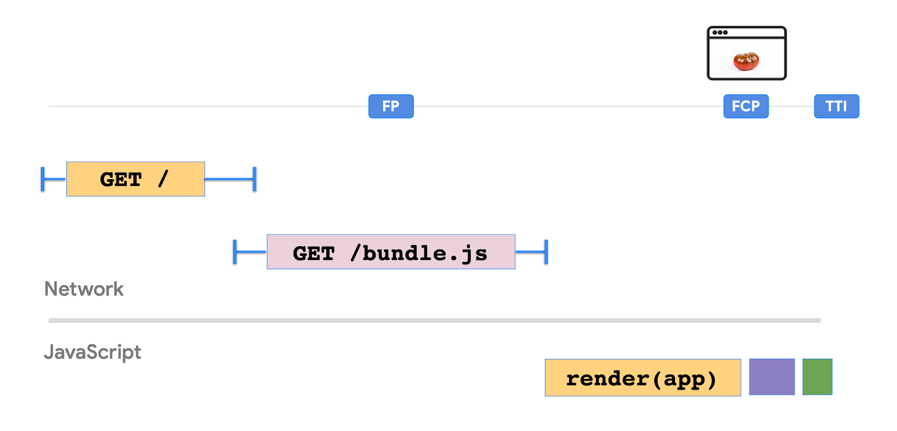

- [Client-side Rendering](#client-side-rendering)
  - [Cấu trúc cơ bản](#cấu-trúc-cơ-bản)
  - [JavaScript bundles và hiệu suất](#javascript-bundles-và-hiệu-suất)
  - [Ưu điểm và nhược điểm](#ưu-điểm-và-nhược-điểm)
  - [Cải thiện hiệu suất CSR](#cải-thiện-hiệu-suất-csr)

# Client-side Rendering

Render UI ứng dụng của bạn trên client.

Trong Client-Side Rendering (CSR) chỉ có khung HTML cơ bản cho một trang được render bởi server. Logic, fetch dữ liệu (data fetching), tạo template (templating) và điều hướng (routing) cần thiết để hiển thị nội dung trên trang được xử lý bằng JavaScript thực thi ngay trên browser/client. CSR trở nên phổ biến như một phương thức để xây dựng single-page application (SPA). Nó làm mờ sự khác biệt giữa website mà một ứng dụng được cài đặt.

Để đánh giá tốt hơn những lợi ích mà các pattern khác mang lại, trước tiên chúng ta hãy xem xét kỹ hơn về Client-Side Rendering (CSR) và tìm ra những tình huống mà nó hoạt động tốt và những nhược điểm của nó là gì.

## Cấu trúc cơ bản

Xem xét ví dụ đơn giản này hiển thị và cập nhật thời gian hiện tại trên một trang bằng React.

**index.js**

```js
function tick() {
  const element = (
    <div>
      <h1>Hello, world!</h1>
      <h2>It is {new Date().toLocaleTimeString()}.</h2>
    </div>
  );
  ReactDOM.render(element, document.getElementById("root"));
}

setInterval(tick, 1000);
```

**index.html**

```html
<div id="root"></div>
```

HTML chỉ bao gồm thẻ `<div>` root duy nhất. Mặt khác, hiển thị và cập nhật nội dung được xử lý hoàn toàn bằng JavaScript. Không cần gửi yêu cầu tới máy chủ và HTML được cập nhật tại chỗ. Tại đây, thời gian có thể được thay thế bằng bất kỳ thông tin real-time nào khác như tỷ giá hối đoái hoặc giá cổ phiếu lấy được từ API và được hiển thị mà không cần refresh lại trang hoặc yêu cầu tới máy chủ.

## JavaScript bundles và hiệu suất

Khi độ phức tạp của trang tăng lên để hiển thị hình ảnh, hiển thị dữ liệu từ kho dữ liệu và bao gồm xử lý sự kiện, độ phức tạp và kích thước của code JavaScript cần thiết để render trang cũng tăng lên. CSR dẫn đến JavaScript bunldes lớn làm tăng FCP và TTI của trang.



Như thể hiện trong hình minh hoạ ở trên, khi kích thước _bundle.js_ tăng lên, FCP và TTI được đẩy lên phía trước. Điều này ngụ ý rằng người dùng sẽ thấy một màn hình trắng trong toàn bộ khoảng thời gian giữa FP và FCP.

## Ưu điểm và nhược điểm

Với React hầu hết logic của ứng dụng được thực thi ở client và nó tương tác với server thông qua call API để fetch hoặc lưu dữ liệu. Do đó hầu hết UI được tạo ở client. Toàn bộ ứng dụng web được tải ở lần request đầu tiên. Khi người dùng điều hướng bằng cách click vào liên kết, không có request mới nào được tạo cho server để render các trang. Code chạy bên dưới client để thay đổi view, dữ liệu.

CSR cho phép chúng ta tạo một Single-Page Application hỗ trợ điều hướng mà không refresh lại trang và cung cấp một UX tuyệt vời. Do việc xử lý dữ liệu để thay đổi view bị giới hạn, định tuyến giữa các trang thường nhanh hơn khiến ứng dụng CSR có vẻ phản hồi nhanh hơn. CSR cũng cho phép các developer tách biệt rõ ràng giữa code client và server.

Mặc dù trải nghiệm tương tác tuyệt vời mà nó cung cấp, thế nhưng CSR vẫn có một số cân nhắc:

1. **Cân nhắc về SEO**: Hầu hết các trình thu thập dữ liệu web có thể diễn giải các trang web do server render một cách đơn giản. Mọi thứ trở nên phức tạp hơn trong trường hợp client-side rendering do payload lớn và một loạt các request (đối với API response) có thể dẫn đến những nội dung quan trọng không được render đủ nhanh để trình thu thập lập chỉ mục nội dung đó. Trình thu thập dữ liệu có thể hiểu JavaScript nhưng có những hạn chế. Do đó một số cách giải quyết được yêu cầu để làm cho website render phía client thân thiện với SEO.

2. **Hiệu suất**: Với client-side rendering, thời gian phản hồi trong quá trình tương tác được cải thiện đáng kể vì không có request đến server. Tuy nhiên, đển trình duyệt render nội dung phía client lần đầu tiên, chúng phải đợi JavaScript tải trước và bắt đầu xử lý. Do đó người dùng sẽ cảm thấy lag khi tải trang lần đầu. Điều này có thể ảnh hưởng đến UX khi kích thước gói JavaScript lớn hơn hoặc máy client không đủ mạnh để xử lý.

3. **Khả năng bảo trì code**: Một số thành phần của code có thể bị lặp lại trên client và server (APIs) trong nhiều ngôn ngữ khác nhau. Trong các trường hợp khác, có thể không thực hiện được việc phân tách rõ ràng logic nghiệp vụ. Ví dụ về điều này có thể bao gồm xác thực và logic định dạng cho các trường tiền tệ và ngày tháng.

4. **Fetch dữ liệu**: Với client-side rendering, fetch dữ liệu thường theo hướng sự kiện. Trang ban đầu có thể được tải mà không có dữ liệu. Sau đó dữ liệu có thể được fetch bằng cách gọi API khi xảy ra các sự kiện như tải trang hoặc nhấp vào nút. Tuỳ vào kích thước dữ liệu, điều này có thể làm tăng thời gian tải của ứng dung.

Tầm quan trọng của những cân nhắc này có thể khác nhau giữa các ứng dụng. Developer thường quan tâm đến việc tìm kiếm các giải pháp thân thiện với SEO để có thể phục vụ các trang nhanh hơn mà không làm ảnh hưởng đến thời gian tương tác. Sự ưu tiên được gắn cho các tiêu chí hiệu suất khác nhau có thể khác nhau dựa trên các yêu cầu của ứng dụng. Đôi khi có thể sử dụng client-side rendering với một số thay đổi nhỏ là đủ thay vì tìm một pattern khác hoàn toàn.

## Cải thiện hiệu suất CSR

Vì hiệu suất của CSR tỉ lệ nghịch với kích thước của gói JavaScript, điều tốt nhất chúng ta có thể làm là cấu trúc code JavaScript của mình để có được hiệu suất tối ưu. Sau đây là danh sách các gợi ý có thể giúp:

- **Kiểm soát JavaScript**: Đảm bảo rằng bạn quản lý JavaScript hợp lý cho lần tải trang đầu tiên. Một gói ban đầu có dung lượng khoảng < 100-170 KB được minify và nén bằng gzip là một khởi đầu tốt. Sau đó, code có thể được tải theo yêu cầu khi cần.

- **Tải trước (Preloading)**: Kỹ thuật này có thể được sử dụng để tải trước các tài nguyên quan trọng mà trang yêu cầu. Các tài nguyên quan trọng có thể bao gồm JavaScript có thể được tải trước bằng cách thêm câu lệnh sau vào phần `<head>` của HTML.

  ```html
  <link rel="preload" as="script" href="critical.js" />
  ```

  Điều này thông báo cho trình duyệt bắt đầu tải file `critical.js` trước khi trang bắt đầu render. Do đó, file sẽ có sẵn sớm hơn và sẽ không chặn cơ chế render của trang nên cải thiện hiệu suất.

- **Lazy loading**: Với lazy loading, bạn có thể xác định các tài nguyên không quan trọng và chỉ tải những tài nguyên này khi cần. Thời gian tải trang lần đầu có thể cải thiện bằng cách sử dụng phương pháp này vì kích thước của tài nguyên ban đầu giảm. Ví dụ: một widget chat thường không cần thiết ngay khi tải trang và nó có thể được lazy load.

- **Phân tách code (Code spliting)**: Để tránh tình trạng gói JavaScript có kích thước lớn, bạn có thể chia tách các gói ra. Code-Spliting được hỗ trợ bởi các bundler như [Webpack](https://webpack.js.org/guides/code-splitting/), nơi nó có thể được sử dụng để tạo nhiều gói có thể được tải động khi chạy. Việc phân tách code cũng giúp bạn lazy load các tài nguyên JavaScript.

- **Application Shell Caching with Service Workers**: Kỹ thuật này liên quan đến việc lưu vào bộ nhớ đệm cấu trúc căn bản của một ứng dụng web (Application Shell) là HTML, CSS, JavaScript. Service Workers có thể được sử dụng để cache application shell offline. Điều này có thể hữu ích trong việc cung cấp trải nghiệm một native single-page app trong đó nội dung còn lại được tải dần dần khi cần.

Với những kỹ thuật này, CSR có thể giúp cung cấp một trải nghiệm Single-Page Application nhanh hơn với FCP và TTI phù hợp.
