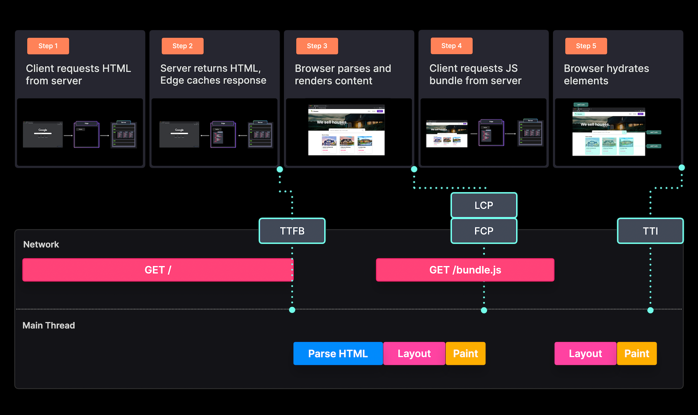

# Giới thiệu

Khi bạn bắt đầu thiết kế và xây dựng một ứng dụng web mới, một trong những quyết định cơ bản mà bạn đưa ra là: _"Tôi muốn hiển thị nội dung như thế nào và ở đâu?"_. Nó nên được render ở web server, build server, Edge hay trực tiếp ở client. Nó nên được render tất cả cùng một lần (all at once), từng phần (partial) hay tải dần dần (progressive).

Câu trả lời cho những quyết định quan trọng này phần lớn phụ thuộc vào tuỳ trường hợp sử dụng. Chọn rendering pattern phù hợp nhất có thể tạo ra sự khác biệt lớn đối với trải nghiệm lập trình (Developer Experience (DX)) mà bạn tạo ra cho team và trải nghiệm người dùng (User Experience (UX)) mà bạn tạo ra cho người dùng cuối.

Chọn một pattern phù hợp có thể xây dựng nhanh hơn, hiệu suất cao hơn với chi phí thấp nhất. Mặt khác, chọn sai pattern có thể giết chết một ứng dụng mà có thể mang đến một ý tưởng kinh doanh tuyệt vời. Vì vậy bạn phải đảm bảo rằng mọi ý tưởng mang tính cách mạng mà bạn có phải được phát triển với một rendering pattern phù hợp.

## Tầm quan trọng của các rendering pattern

Để tạo ra một UX tuyệt vời, chúng ta thường cố gắng tối ưu ứng dụng của mình theo các chỉ số lấy người dùng làm trung tâm (user-centric), chẳng hạn như [Core Web Vitals (CWV)](https://web.dev/vitals/). Chỉ số CWV đo lường các thông số phù hợp nhất với trải nghiệm người dùng. Tối ưu chỉ số CWV có thể giúp đảm bảo một UX tuyệt vời và tối ưu SEO cho các ứng dụng của chúng ta.

Để tạo ra một DX tuyệt với cho các thành viên trong team. Chúng ta phải tối ưu môi trường phát triển phần mềm của mình bằng cách đảm bảo thời gian build phải nhanh, dễ rollback, dễ dàng mở rộng và nhiều tính năng khác để giúp các lập trình viên thành công.

Việc xây dựng một môi trường phát triển dựa trên những nguyên tắc này cho phép các team tạo ra những sản phẩm tuyệt vời một cách hiệu quả.

Tóm lại, chúng tôi đã xây dựng một danh sách khá dài. Nhưng nếu bạn chọn một rendering pattern hợp lý, bạn có thể nhận được những lợi ích này ngay lập tức.

## Chọn một pattern

Rendering pattern đã đi một chặng đường dài, từ Server Side Rendering (SSR) và Client Side Rendering (CSR) đến các pattern phức tạp được thảo luận và đánh giá trên các diễn đàn ngày nay. Mặc dù nó có thể trở nên áp đảo, nhưng nên nhớ rằng mỗi pattern được thiết kế ra để giải quyết các trường hợp cụ thể. Một pattern có thể có lợi trong trường hợp này, nhưng cũng có thể bất lợi trong trường hợp khác. Nó cũng giống như mỗi trang khác nhau yêu cầu một rendering pattern khác nhau trên cùng một website.

Chrome team đã [khuyến khích](https://web.dev/rendering-on-the-web/) các lập trình viên cân nhắc sử dụng static hay server-side rendering thay vì phương pháp rehydration. Theo thời gian, mặc định các kỹ thuật tải và render dần dần (progressive) có thể giúp đạt được sự cân bằng giữa hiệu suất và tính năng khi sử dụng các framework hiện đại.

Các chương tiếp theo sẽ khái quát các pattern khác nhau - cũ và mới một cách chi tiết. Nhưng trước tiên, chúng tôi sẽ giới thiệu ngắn gọn về một số trong số đó để giúp bạn hiểu rằng chúng sẽ hoạt động tốt nhất ở đâu.

### Static Rendering

Static rendering là một pattern đơn giản nhưng mạnh mẽ, có thể sử dụng để xây dựng một website cực nhanh với tốc độ tải trang gần như ngay lập tức.

Với static rendering, HTML của toàn bộ trang đã được tạo ra khi build và sẽ không thay đổi cho đến lần build tiếp theo. Nội dung của HTML là tĩnh và dễ dàng cache ở CDN hoặc Edge. Các CDN có thể nhanh chóng gửi bản render HTML đã được cache trước đó cho client khi họ gửi request một trang cụ thể. Điều này cắt giảm đáng kể thời gian cần thiết để xử lý request, render HTML và phản hồi request là một điển hình trong thiết lập server-side rendering.

Quá trình được mô tả bên trên phù hợp cho những trang mà không thường xuyên thay đổi và hiển thị cùng một dữ liệu không quan trọng ai là người request. Vì ngày nay chúng ta sử dụng nhiều dữ liệu động, tuỳ chỉnh trên web nên có các biến thể của static rendering để phục vụ cho những trường hợp khác nhau.

### Basic/Plain Static Rendering

Vì có nhiều biến thể của static rendering, hãy gọi kỹ thuật chúng ta đã thảo luận trước đó là Plain Static Rendering. Bạn có thể sử dụng nó cho những trang có ít hoặc không có nội dụng động.

Một trang trong website giới thiệu bất động sản luôn hiển thị cùng một nội dung đối với tất cả mọi người trên toàn cầu. Nó không chứa bất kỳ dữ liệu động hay dữ liệu cá nhân nào.

Khi mà website được triển khai và build (ví dụ trên Vercel), HTML tương ứng được tạo ra và được lưu trên bộ nhớ của server.

Khi một người request một trang, server gửi HTML đã tạo trước đó tới client. Response này cũng được cache lại ở vị trí gần người dùng nhất. Sau đó trình duyệt render HTML và sử dụng JavaScript để hydrate cho trang.

Plain static rendering tuyệt vời về mặt hiệu suất bởi vì nó có kết quả **TTFB cực kỳ nhanh** do HTML đã có sẵn trên server. Trình duyệt nhận được phản hồi nhanh hơn và có thể render một cách nhanh chóng, kết quả là **FCP và LCP nhanh**. Bởi vì nội dung tĩnh nên **không có sự thay đổi bố cục** trong khi render nó.

Do đó, Plain Static Rendering, đặc biệt là dùng CDN để cache, giúp đạt được các chỉ số CWV tuyệt vời. Tuy nhiên, hầu hết các website có ít nhất một vài nội dung động hoặc cho phép người dùng tương tác.

### Static Rendering with Client-Side `fetch`

Giả sử chúng ta muốn nâng cấp website giới thiệu bất động sản để hiển thị danh sách bất động sản mới nhất gần đây. Chúng ta phải sử dụng một trình cung cấp dữ liệu để lấy được danh sách đó.

Chúng ta có thể dùng **Static Rendering with Client-Side `fetch`** trong trường hợp này. Pattern này hoạt động tốt khi bạn muốn cập nhật dữ liệu mỗi lần request.

Bạn vẫn có thể sử dụng static rendering cho website để render một **skeleton component** ở chỗ mà bạn muốn đặt danh sách dữ liệu động. Sau khi trang đã được tải xong, chúng ta có thể fetch dữ liệu (ví dụ sử dụng SWR) trên client.

Một **custom API route** dùng để fetch dữ liệu từ CMS và trả về dữ liệu.

File HTML đã được tạo trước sẽ được gửi tới client khi mà người dùng request một trang. Ban đầu người dùng sẽ nhìn thấy skeleton UI không có bất kỳ dữ liệu nào. Client fetch dữ liệu từ API, nhận response và hiển thị danh sách. (ví dụ trên chưa bao gồm hydration call)

Mặc dù **Static Rendering with Client-Side `fetch`** mang lại cho chúng ta **TTFB và FCP tốt**, nhưng **LCP lại không tối ưu** bởi vì "largest content" chỉ có thể hiển thị sau khi chúng ta lấy được danh sách dữ liệu từ API.

Cũng có khả năng lớn gây ra **thay đổi bố cục (layout shift)**, đặc biệt nếu kích thước của skeleton UI không bằng với kích thước nội dung được hiển thị.

Một nhược điểm khác của cách tiếp cận này là có thể dẫn đến **chi phí server cao hơn** bởi vì chúng ta gọi API một lần mỗi request trang.

Next.js đã đưa ra một vài giải pháp để cải thiện hiệu suất ứng dụng của bạn khi làm việc với dữ liệu động, được thảo luận trong các phần dưới đây.

### Static with `getStaticProps`

Method này cho phép bạn truy cập vào trình cung cấp dữ liệu và fetch dữ liệu tại khi build trên server. Nó có thể là một giải pháp tốt nếu bạn biết rằng dữ liệu động trên trang tĩnh sẽ luôn có sẵn khi build.

Method `getStaticProps` cho phép chúng ta tạo ra HTML với dữ liệu trên server. Do đó, chúng ta có thể tránh tạo các API để fetch dữ liệu trên máy khách. Tương tự, không cần skeleton component trong khi tải dữ liệu vì trang sẽ được hiển thị cũng với dữ liệu.

Khi build dự án, trình cung cấp dữ liệu sẽ được gọi và dữ liệu được trả về sẽ được gắn vào HTML đã tạo.

Khi người dùng request đến một trang, quá trình cũng tương tự như plain static rendering. Response đã được cache và được render lên màn hình, trình duyệt sẽ fetch các file Javascript để hydrate trang đó.

Từ góc độ client, network mà main thread hoạt động giống hệt với plain static rendering, vì vậy chúng ta có hiệu suất vượt trội tương tự.

Khi website ngày càng lớn, DX khi sử dụng method có thể không tốt lắm.

Đối với các website có hàng trăm trang được tạo tĩnh (ví dụ các blog) việc gọi lặp lại method `getStaticProps` có thể dẫn đến **thời gian build lấu**. Nếu bạn sử dụng một API từ bên ngoài, bạn có thể chạm đến giới hạn request hoặc một **hoá đơn thanh toán lớn hơn**.

Phương pháp này cũng chỉ phù hợp khi chúng ta có thể thoát khỏi việc không làm mới dữ liệu thường xuyên khi build. Cập nhật dữ liệu thường xuyên có nghĩa là chúng ta phải build lại và deploy lại website.

### Incremental Static Regeneration

Chúng ta có thể sử dụng incremental static regeneration để giải quyết thời gian build và dữ liệu động đã thảo luận trước đó.

ISR theo nghĩa là hybrid nó cho phép chúng ta render trước một vài trang tĩnh và render các trang động theo yêu cầu khi người dùng request chúng. Kết quả là thời gian build ngắn hơn và cho phép tự động vô hiệu cache và tạo lại trang sau một khoảng thời gian cụ thể.

Giả sử bây giờ chúng ta muốn hiển thị chi tiết của bất động sản của website bất động sản trước đó. Chúng ta có thể render trước những trang mới này để chúng tải nhanh hơn khi người dùng nhập vào.

Next.js giúp chúng ta đạt được điều này bằng cách sự dụng method `getStaticPaths` tạo ra các đường dẫn động. Chúng ta có thể cho Next.js biết trang nào sẽ được tạo trước dựa trên query param của chúng.

Đối với demo của chúng ta, hãy fetch toàn bộ danh sách và tạo trước các trang cho mỗi item trong danh sách đó. Chú ý rằng nó sẽ rất lâu nếu nó là một danh sách có hàng ngàn item. Trong trường hợp này, chúng ta sẽ bảo Next chỉ tạo trước một vài trang và hiển thị fallback khi các trang còn lại trong danh sách được tạo theo yêu cầu (khi người dùng request).

Các trang được render trước và các trang được tạo theo yêu cầu thì tương tự. Nếu người dùng request một trang mà chưa được tạo, nó sẽ được tạo theo yêu cầu và được cache bởi Edge. Do đó chỉ người dùng đầu tiên mới có trải nghiệm kém hơn do trang đó chưa được render trước. Những người khác sẽ được hưởng lợi từ việc phản hồi nhanh và phản hồi được lưu trong bộ nhớ cache.

Điều này giải quyết vấn đề thời gian build lâu của các phương pháp trước đó. Nhưng chúng ta vẫn còn trang đích cần được deploy lại mỗi khi chúng ta có danh sách mới.

Để bận tính năng làm mới trang đích, chúng ta có thể tự động vô hiệu hoá cache và tạo lại trang sau một khoảng thời gian cụ thể. Chúng ta có thể sự dụng tính năng này bằng cách thêm trường `revalidate` vào object được trả về.

Nếu một người dùng request một trang đã ở trong bộ nhớ cache lâu hơn thời gian được chỉ định, ban đầu người dùng sẽ thấy trang cũ. Việc tạo lại trang được kích hoạt đồng thời. Sau khi được tạo lại ở chế độ nền, cache sẽ bị vô hiệu hoá và được cập nhật bằng trang vừa được tạo gần đây.

Với Incremental Static Regeneration, chúng ta có thể hiển thị nội dung động bằng cách tự động xác nhận lại trang mỗi vài giây.

Mặc dù đây đã là một cải tiến hơn so với những gì chúng ta có trước đó, những nó cũng có vài nhược điểm. Nội dung của chúng ta có thể không cập nhật thường xuyên nhưng khoảng thời gian chúng ta đã xác định. Điều này sẽ dẫn đến việc tạo tạo trang không cần thiết và làm mất hiệu lực bộ nhớ cache. Mỗi khi điều này xảy ra, chúng ta sẽ gọi các chức năng serverless của mình, điều này có thể dẫn đến chi phí server cao hơn.

### On-demand Incremental Static Regeneration

Để giải quyết những nhược điểm cuối cùng đã đền cập ở trên, chúng ta có On-demand Incremental Static Regeneration cho phép chúng ta sử dụng ISR nhưng được tạo lại trong một số trường hợp nhất định chứ không phải sau khoảng thời gian nhất định.

Thay vì sử dụng trường `revalidate`, chúng ta xác nhận lại dựa trên dữ liệu mới trong API.

Ví dụ, chúng ta có thể lắng nghe một webhook cho chúng ta biết khi nào có dữ liệu mới được thêm vào. Khi chúng ta gọi phương thức xác thực lại, trang tại một đường dẫn chỉ định sẽ tự động tạo lại.

Với ISR thông thường, trang được cập nhật chỉ được cache tại các nút (egde node) mà đã xử lý yêu cầu cho trang đó. On-demand ISR tạo lại và phân phối lại trang qua edge network để người dùng trên toàn thế giới sẽ tự động nhìn thấy phiên bản mới nhất của trang từ edge cache mà không thấy nội dung cũ. Chúng ta cũng có thể tránh được những tạo lại không cần thiết và những gọi hàm serverless, giảm chi phí vận hành so với ISR thông thường.

Do đó On-demand ISR mang lại cho chúng ta lợi ích về hiệu suất và DX tuyệt vời.

Nhìn chung Static Generation là một pattern tuyệt vời, và các biến thể của nó (đặc biệt là ISR) có thể bao gồm nhiều trường hợp sử dụng khác nhau.

Nó cho phép chúng ta có những website nhanh và động, luôn trực tuyến với chi phí hợp lý. Tuy nhiên, có những trường hợp mà static không phải là lựa chọn tốt nhất, ví dụ các trang được cá nhân hoá, tính động cao, khác nhau đối với mỗi người dùng. Hãy xem những pattern nào hoạt động tốt nhất đối với những điều này.

### Server-Side Rendering

Với server-side rendering, chúng ta tạo HTML cho mỗi request. Cách tiếp cận này phù hợp nhất cho những trang chứa dữ liệu cá nhân hoá cao, ví dụ dữ liệu dựa trên cookie của người dùng hoặc bất kỳ dữ liệu nào thu được từ request của người dùng. Nó cũng phù hợp cho những trang cần chặn hiển thị dựa trên trạng thái xác thực.

Một dashboard cá nhân hoá là một ví dụ tuyệt vời về dữ liệu có tính động cao trên một trang. Hầu hết nội dung đều dựa vào id của người dùng hoặc mức độ uỷ quyền có thể có trong cookie người dùng. Dashboard này chỉ hiển thị khi người dùng được xác thực và có thể hiễn thị những dữ liệu nhạy cảm dành riêng cho người dùng, những dữ liệu mà không được hiển thị cho những người khác.

Next.js cho phép chúng ta render một trang trên server bằng cách sử dụng method `getServerSideProps`. Method này chạy trên server mỗi lần có request và chuyển dữ liệu trả về tới trang để tạo HTML.

Khi một user request một trang, method `getServerSideProps` sẽ chạy, trả về dữ liệu dùng để tạo trang và gửi response về cho client. Client sẽ render HTML này và gửi một request khác fetch JavaScript để hydrate.

Nội dung HTML được tạo là duy nhất đối với mỗi request và không được cache bởi CDN.

Network và main thread ở client rất giống nhau đối với static và server-side rendering. FCP hầu như bằng LCP và chúng ta có thể dễ dàng tránh thay đổi bố cục (layout shift) vì không có nội dung động nào được tải sau lần tải trang đầu tiên.

Tuy nhiên, TTFB của trang được tạo bởi server dài hơn đáng kể so với static rendering do trang được tạo từ đầu theo mọi request.

Mặc dù server-rendering là một phương thức tuyệt vời khi bạn muốn render dữ liệu có tính cá nhân hoá cao nhưng có một số điều cần xem xét để đạt được UX tốt và giảm chi phí server. Chúng có khả năng là cao bởi vì bạn gọi các chức năng serverless mỗi request.

1. **Thời gian thực thi của `getServerSideProps`**

   Việc tạo trang không được bắt đầu cho tới khi có dữ liệu từ `getServerSideProps`. Do đó chúng ta phải đảm bảo rằng method `getServerSideProps` không chạy quá lâu.

2. **Triển khai database trong cùng khu vực với serverless function của bạn**

   Nếu dữ liệu đến từ database, chúng ta phải giảm thời gian truy vấn dữ liệu. Ngoài tối ưu thời gian truy vấn, bạn cũng cần xem xét vị trí đặt database.

   

   Nếu serverless function của bạn đặt ở San Francisco nhưng database của bạn ở Tokyo, việc thiết lập kết nối và nhận dữ liệu có thể mất một chút thời gian. Thay vào đó, hãy xem xét dời database của bạn đến cùng khu vực với serverless function để đảm bảo rằng truy vấn database trả về dữ liệu nhanh hơn.

3. **Thêm `Cache-control` vào response hearders**

   Một cách khác để cải thiện hiệu suất SSR là thêm Cache-Control vào response headers.

4. **Nâng cấp phần cứng server**

   Nâng cấp phần cứng server có thể giúp xử lý các yêu cầu riêng lẻ một cách nhanh chóng và phản hồi nhanh hơn.

Vercel sử dụng serverless function để server-render các trang của bạn.

Mặc dù serverless function có nhiều lợi ích chẳng hạn như chỉ trả tiền cho những gì bạn sử dụng nhưng nó cũng có một vài hạn chế. Thời gian để khởi động lambda (được gọi là cold boot lâu) là một vấn đề phổ biến đối với các serverless function. Ngoài ra các kết nối đến database có thể bị chậm. Bạn cũng không nên gọi một serverless function nằm ở nữa bên kia trái đất.

### Edge SSR + HTTP Streaming

Vercel hiện đang khám phá Edge Server-Side Rendering sẽ cho phép người dùng **server-render từ tất cả khu vực** và trải nghiệm **cold boot gần như bằng không**. Một lợi ích khác của **Edge SSR** là edge runtime cho phép **HTTP streaming**.

Với serverless function, chúng ta tạo ra toàn bộ trang phía server và đợi cho toàn bộ bundle được tải và phần tích ở client trước khi quá trình hydrate có thể bắt đầu.

Với Edge SSR, chúng ta có thể stream các phần ngay khi chúng sẵn sàng và hydrate các phần này. Điều này giúp giảm thời gian chờ đợi của người dùng vì họ có thể nhìn thấy các thành phần khi chúng stream từng cái một.

**Streaming SSR** cũng cho phép **React Server Components**. Sự kết hợp của **Edge SSR với React Server Components** có thể cho chúng ta có một sự **kết hợp giữa static và server rendering** đẹp mắt.

**React Server Components** cho phép chúng ta render một phần các component của React trên server, điều này hữu ích cho các component có các dependency lớn mà không cần tải xuống client.

Quay lại website bất động sản, nếu chúng ta muốn hiển thị trang đích và danh sách cụ thể theo vùng cho người dùng. Phần lớn trang chỉ chứa dữ liệu tĩnh, đó chỉ danh sách dữ liệu dựa trên request.

Thay vì server-render toàn bộ trang, bây giờ chúng ta chọn chỉ render component danh sách ở phía server và phần còn lại ở phía client. Trong khi ban đầu chúng ta phải server-render toàn bộ trang để đạt được mục đích này, giờ đây chúng ta có thể đạt được **hiệu suất tuyệt vời của Static Rendering với lợi ích của Server-Side Rendering**.

## Kết luận

Hiện chúng tôi đã giới thiệu nhiều pattern render nội dung trên server. [Client Side Rendering](client-side-rendering.md) (CSR) với khả năng rehydrate hoàn toàn vẫn được khuyến nghị cho các website động, nơi mọi thành phần trên màn hình đều có thể thay đổi dựa trên tương tác của người dùng.

Tuỳ thuộc vào loại ứng dụng hoặc loại trang web, một vài pattern có thể phù hợp hơn những pattern. Biểu đồ dưới đây so sánh các điểm nổi bật của các pattern khác nhau và cung cấp các trường hợp sử dụng cho từng cái.

Bảng dưới đây từ [Patterns for Building JavaScript Websites in 2022](https://dev.to/this-is-learning/patterns-for-building-javascript-websites-in-2022-5a93) cung cấp một cái nhìn khác xoay quanh các đặc điểm chính của ứng dụng. Nó sẽ hữu ích cho bất kỳ ai đang tìm kiếm một pattern phù hợp cho các [ứng dụng kiểu mẫu](https://jasonformat.com/application-holotypes/) phổ biến.

|                       | PORTFOLIO        | CONTENT              | STOREFRONT            | SOCIAL NETWORK         | IMMERSIVE        |
| --------------------- | ---------------- | -------------------- | --------------------- | ---------------------- | ---------------- |
| **Holotype**          | Personal Blog    | CNN                  | Amazon                | Facebook               | Figma            |
| **Interactivity**     | Minimal          | Linked Articles      | Purchase              | Multi-Point, Real-time | Everything       |
| **Session Depth**     | Shallow          | Shallow              | Shallow - Medium      | Extended               | Deep             |
| **Values Simplicity** | Discover-ability | Load                 | Performance           | Dynamicism             | Immersiveness    |
| **Routing**           | Server           | Server, Hybrid       | Hybrid, Transitional  | Transitional, Client   | Client           |
| **Rendering**         | Static           | Static, SSR          | Static, SSR           | SSR                    | CSR              |
| **Hydration**         | None             | Progressive, Partial | Partial, Resumable    | Any                    | None (CSR)       |
| **Example Framework** | 11ty             | Astro, Elder         | Marko, Qwik, Hydrogen | Next, Remix            | Create React App |
