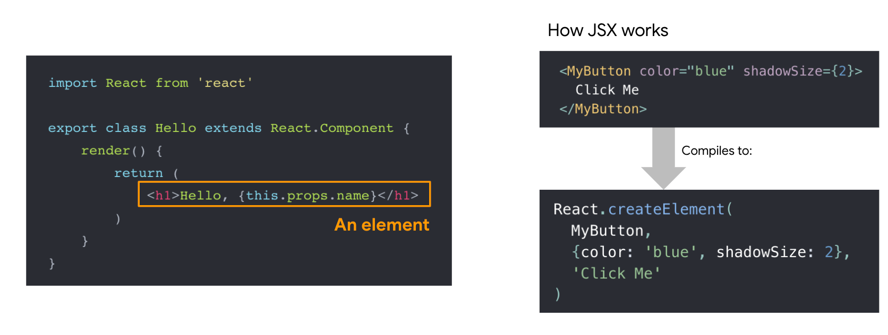
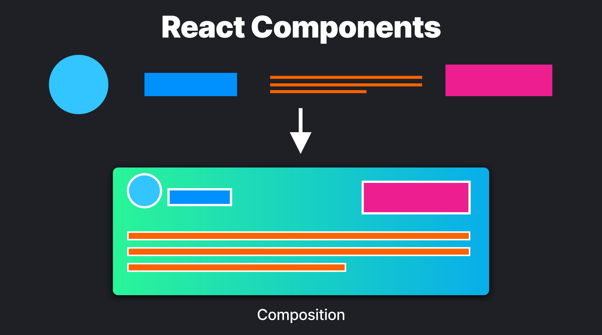
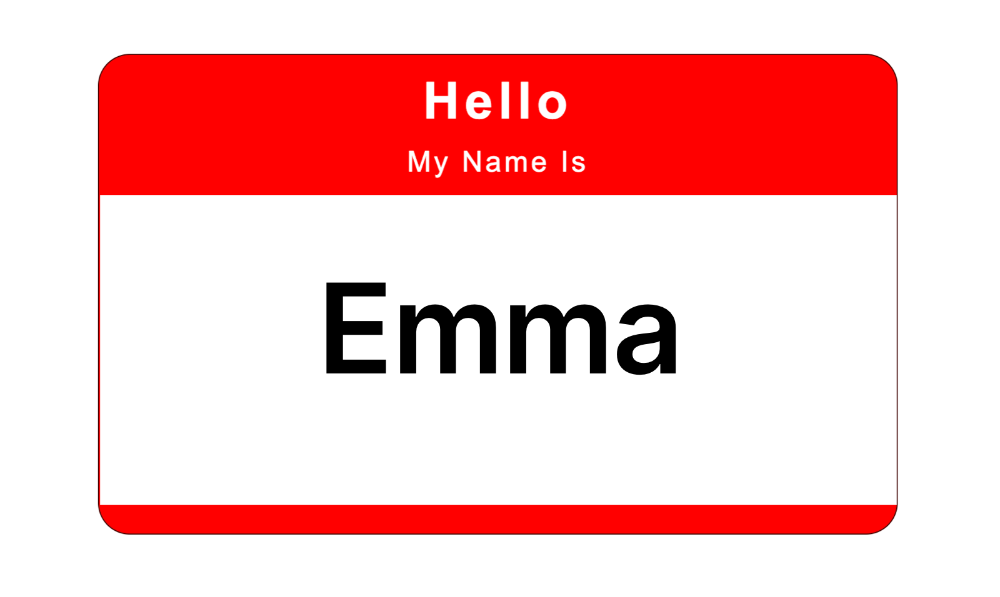
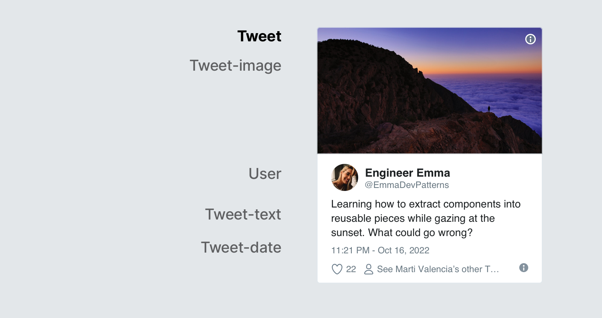
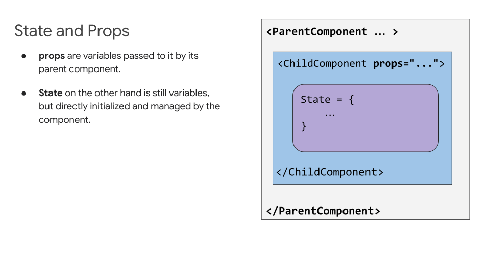
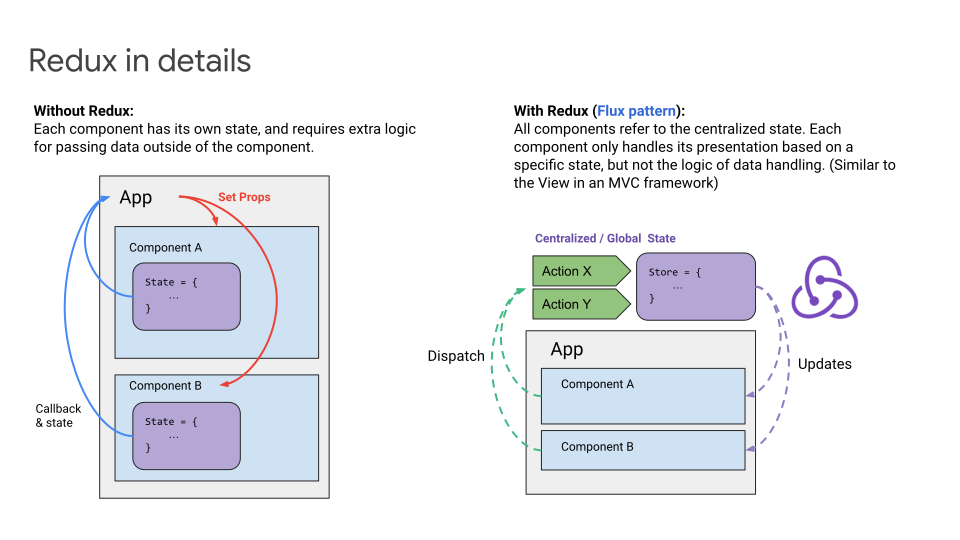
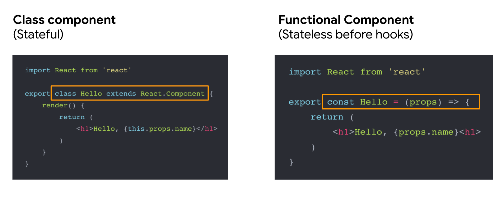
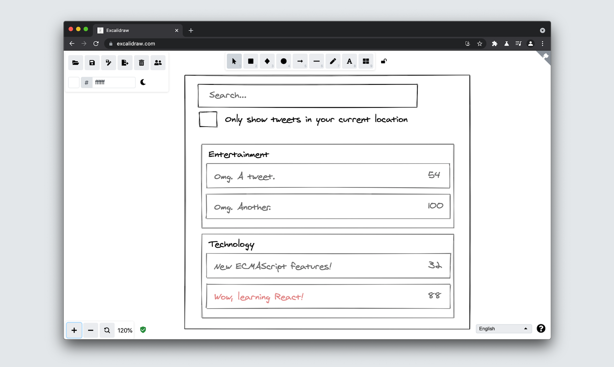
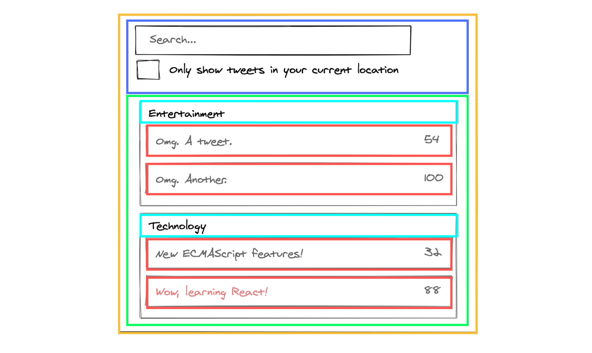

- [Tổng quan về React.js](#tổng-quan-về-reactjs)
  - [Thuật ngữ sẽ sử dụng](#thuật-ngữ-sẽ-sử-dụng)
  - [Rendering with JSX](#rendering-with-jsx)
  - [Components, Props, and State](#components-props-and-state)
    - [1. Components](#1-components)
    - [Phần tách components](#phần-tách-components)
    - [2. Props](#2-props)
    - [3.State](#3state)
      - [Làm cách nào để thêm State trong React](#làm-cách-nào-để-thêm-state-trong-react)
    - [Props vs State](#props-vs-state)
  - [Những khái niệm khác trong React](#những-khái-niệm-khác-trong-react)
    - [1. Lifecycle](#1-lifecycle)
    - [2. Higher-order component (HOC)](#2-higher-order-component-hoc)
    - [3. Context](#3-context)
  - [React Hooks](#react-hooks)
  - [Tư duy trong React](#tư-duy-trong-react)
  - [Kết luận](#kết-luận)

# Tổng quan về React.js

Một thư viện UI dùng để xây dựng các phần giao diện người dùng (UI component) có thể tái sử dụng.


Trong những năm qua, nhu cầu về các cách đơn giản để tạo UI bằng JavaScript ngày càng tăng. [React](https://react.dev/), còn được gọi là React.js, là một thư viện JavaScript mã nguồn mở được tạo ra bởi Facebook, dùng để xây dựng giao diện người dùng hoặc các UI component.

Tất nhiên React không phải là thư viện UI duy nhất hiện nay. [Preact](https://preactjs.com/), [Vue](https://vuejs.org/), [Angular](https://angular.io/), [Svelte](https://svelte.dev/), [Lit](https://lit.dev/) và nhiều thứ tuyệt vời khác để tạo giao diện từ các element có thể tái sử dụng. Với sự phổ biến của React, bạn nên xem qua cách thức hoạt động của nó vì chúng ta sẽ sử dụng nó để xem qua một số design, rendering, performance pattern trong hướng dẫn này.

Khi các front-end developer nói về code, điều đó thường xảy ra nhất trong bối cảnh thiết kế giao diện cho web. Cách chúng ta nghĩ về thành phần giao diện là các element như nút bấm (button), danh sách (list), thanh điều hướng (navigation) và những thứ tương tự. React cung cấp một cách tối ưu và đơn giản để thể hiện giao diện trong các phần tử này. Nó cũng giúp xây dựng các giao diện khó khăn và phức tạp bằng cách tổ chức giao diện của bạn thành ba khái niệm chính: components, props và states.

Bởi vì React tập trung vào thành phần (composition-focused) nên nó có thể ánh xạ hoàn hảo các yếu tố trong hệ thống thiết kế của bạn. Vì vậy về bản chất thiết kế trong React là suy nghĩ theo cách module. Nó cho phép bạn thiết kế các thành phần giao diện riêng lẻ trước khi ghép chúng lại với nhau thành một trang hay view vì vậy bạn sẽ hiểu đầy đủ phạm vi và mục đích của mỗi thành phần - một quá trình được gọi là _thành phần hoá (componentization)_.

## Thuật ngữ sẽ sử dụng

- **React / React.js / ReactJS** - Thư viện React, được tạo ra bởi Facebook năm 2013
- **React DOM** - Một package cho DOM và server rendering
- **JSX** - Cú pháp mở rộng của JavaScript
- **Redux** - Vùng chứa state tập trung
- **Hooks** - Một cách mới để dùng state và các tính năng khác của React mà không cần sử dụng class
- **ReactNative** - Một thư viện JavaScript để phát triển các ứng dụng đa nền tảng (cross-platform native apps)
- **Webpack** - JavaScript module bundler, phổ biến trong cộng đồng React
- **CRA (Create React App)** - Một công cụ CLI để tạo nhanh một dự án React
- **Next.js** - Một React framework với nhiều tính năng như SSR, phần tách code, tối ưu hiệu suất,...

## Rendering with JSX

Chúng ta sẽ sử dụng JSX trong một số ví dụ. JSX là một phần mở rộng của JavaScript nhúng HTML template vào JS sử dụng cú pháp giống XML. Nó sẽ được chuyển đổi thành JavaScript hợp lệ, mặc dù ngữ nghĩa của sự chuyển đổi đó là implementation-specific. JSX đã trở nên phổ biến với thư viện React, nhưng kể từ đó cũng đã thấy các triển khai khác.



## Components, Props, and State

Components, props và state là ba khái niệm chính trong React. Hầu như mọi thứ bạn sẽ thấy hoặc làm trong React đều có thể được phần loại thành ít nhất một trong ba khái niệm chính này, đây là nhìn nhanh qua các khái niệm chính này:

### 1. Components



Components là các viên gạch xây dựng (building blocks) lên bất kỳ ứng dụng React nào. Chúng giống như các hàm JavaScript nhận vào đầu vào tuỳ ý (_Props_) và trả về các React elements mô tả những gì sẽ được hiển thị trên màn hình.

Điều cần hiểu đầu tiên là mọi thứ trên màn hình trong một ứng dụng React là một phần của một component. Về cơ bản, một ứng dụng React chỉ là các component bên trong các component bên trong các component. Vì vậy các developer không xây dựng các trang (page) trong React, họ xây dựng các component.

Component cho phép bạn chia tách UI thành các phần độc lập, có thể tái sử dụng. Nếu bạn quen với việc thiết kế các trang thì suy nghĩ theo kiểu module này có vẻ là một thay đổi lớn. Nhưng nếu bạn sử dụng một design system hay style guide khi đó điều này có thể không phải là một sự thay đổi lớn như nó có vẻ.

Một cách trực tiếp để tạo ra một component là viết một JavaScript function

```js
function Badge(props) {
  return <h1>Hello, my name is {props.name}</h1>;
}
```

Function này là một React component hợp lệ bởi vì nó nhập vào một đối số là đối tượng prop (viết tắt của properties) duy nhất với dữ liệu và trả về một React element. Các component như vầy được gọi là _"function components"_ bởi vì chúng là các JavaScript function.



Ngoài các function components, một loại component khác là _"class components"_. Một class component khác với function component ở chỗ nó được định nghĩa bởi một ES6 class, như minh hoạ bên dưới:

```js
class Badge extends React.Component {
  render() {
    return <h1>Hello, my name is {this.props.name}</h1>;
  }
}
```

### Phần tách components

Để minh hoạ một điều rằng các component có thể chia ra thành các component nhỏ hơn, hãy để ý component `Tweet` bên dưới:



Có thể thực hiện như sau:

```js
function Tweet(props) {
  return (
    <div className="Tweet">
      <div className="User">
        <Image
          className="Avatar"
          src={props.author.avatarUrl}
          alt={props.author.name}
        />
        <div className="User-name">{props.author.name}</div>
      </div>
      <div className="Tweet-text">{props.text}</div>
      <Image
        className="Tweet-image"
        src={props.image.imageUrl}
        alt={props.image.description}
      />
      <div className="Tweet-date">{formatDate(props.date)}</div>
    </div>
  );
}
```

Component này có thể hơi khó thao tác bởi vì nó được nhóm lại và việc sử dụng lại các thành phần riêng lẻ của nó cũng sẽ gây khó khăn. Tuy nhiên chúng ta có thể tách được một vài component từ nó.

Cái đầu tiên chúng ta sẽ tách ra là `Avatar`:

```js
function Avatar(props) {
  return (
    <Image
      className="Avatar"
      src={props.user.avatarUrl}
      alt={props.user.name}
    />
  );
}
```

`Avatar` không cần phải biết nó được render bên trong `Comment`. Đây là lý do tại sao chúng ta đặt cho prop một cái tên chung chung: _user_ hơn là _author_

Bây giờ đã đơn giản hơn một chút:

```js
function Tweet(props) {
  return (
    <div className="Tweet">
      <div className="User">
        <Avatar user={props.author} />
        <div className="User-name">{props.author.name}</div>
      </div>
      <div className="Tweet-text">{props.text}</div>
      <Image
        className="Tweet-image"
        src={props.image.imageUrl}
        alt={props.image.description}
      />
      <div className="Tweet-date">{formatDate(props.date)}</div>
    </div>
  );
}
```

Cái tiếp theo chúng ta sẽ làm là một `User` component để hiển thị một `Avatar` kế bên tên người dùng:

```js
function User(props) {
  return (
    <div className="User">
      <Avatar user={props.user} />
      <div className="User-name">{props.user.name}</div>
    </div>
  );
}
```

Bây giờ chúng ta sẽ đơn giản hoá `Tweet` hơn nữa:

```js
function Tweet(props) {
  return (
    <div className="Tweet">
      <User user={props.author} />
      <div className="Tweet-text">{props.text}</div>
      <Image
        className="Tweet-image"
        src={props.image.imageUrl}
        alt={props.image.description}
      />
      <div className="Tweet-date">{formatDate(props.date)}</div>
    </div>
  );
}
```

Phân tách các component có vẻ là một công việc tẻ nhạt, nhưng việc có các component có thể tái sử dụng sẽ giúp mọi thứ dễ dàng hơn khi code các ứng dụng lớn hơn. Một tiêu chí cần được xem xét khi đơn giản hoá các component là: nếu một phần UI của bạn được sử dụng nhiều lần (_Button, Panel, Avatar_) hoặc đủ phức tạp (_App, FeedStory, Comment_) thì nó tốt nhất nên được tách thành một component riêng biệt.

### 2. Props

Props là viết tắt của properties và chúng chỉ đơn giản đề cập tới dữ liệu nội bộ của một component trong React. Chúng được viết bên trong component call và được chuyển vào trong component. Chúng cũng sử dụng cú pháp giống như các HTML attribute, ví dụ: _prop="value"_. Hai điều bạn nên biết về props: Đầu tiên, chúng ta xác định giá trị của một prop và sử dụng nó như một phần của kế hoạch chi tiết trước khi xây dựng component. Thứ hai, dữ liệu của prop sẽ không bao giờ thay đổi, tức là prop chỉ được đọc (read-only) khi chúng được truyền vào component.

Cách truy cập vào một prop là tham chiếu nó thông qua thuộc tính "this.props" mà mọi component đều có quyền truy cập.

### 3.State

State là một object giữ một vài thông tin có thể thay đổi trong suốt thời gian tồn tại của component. Có nghĩa nó chỉ là snapshot của dữ liệu được lưu trữ trong Props của component. Dữ liệu có thể thay đổi theo thời gian, vì vậy các kỹ thuật để quản lý cách dữ liệu thay đổi trở nên cần thiết để đảm bảo component hoạt động như cách các lập trình viên muốn, đúng thời điểm - đây được gọi là _quản lý trạng thái (State management)_.



Hầu như không thể đọc một đoạn về React mà không bắt gặp ý tưởng về state-management. Các developer thích giải thích về chủ đề này, nhưng về cốt lõi state management không thực sự phức tạp như người ta tưởng.

Trong React, state cũng có thể quản lý theo global và dữ liệu có thể chia sẻ qua lại giữa các component khi cần. Về cơ bản, điều này có nghĩa trong các ứng dụng React việc tải dữ liệu ở những nơi khác sẽ không tốn kém như đối với các công nghệ khác. Các ứng dụng React thông minh hơn về loại dữ liệu mà chúng lưu, tải và khi nào nên làm việc đó. Điều này mở ra cơ hội để tạo ra các giao diện sử dụng dữ liệu theo những cách mới.

Hãy nghĩ về các React component giống như những micro app với dữ liệu, logic và cách trình bày riêng. Mỗi component nên có một mục đích duy nhất. Là một lập trình viên, bạn có thể quyết định mục đích đó và có toàn quyền kiểm soát cách hoạt động của từng component và dữ liệu nào được sử dụng. Bạn sẽ không còn bị giới hạn bởi dữ liệu trên phần còn lại của trang. Trong thiết kế của bạn, bạn có thể tận dụng điều này theo mọi cách. Có nhiều cơ hội để chỉ định dữ liệu bổ sung để có thể cải thiện UX hoặc làm cho một phần trong thiết kế phù hợp với ngữ cảnh xung quanh.

#### Làm cách nào để thêm State trong React

Khi thiết kế, thêm state là một việc nên để sau cùng. Tốt hơn nên để mọi thứ không có trạng thái (stateless), sử dụng props và events. Điều này là cho components dễ bảo trì, dễ test và dễ hiểu hơn. Việc thêm state nên được thực hiện thông qua một trong hai state container như [Redux](https://redux.js.org/) và [MobX](https://mobx.js.org/README.html) hoặc một container/wrapper component. Redux là một hệ thống state management phổ biến cho các reactive framework khác. Nó triển khai state tập trung và được điều khiển bởi các action.



Trong ví dụ dưới đây, vị trí của state có thể là chính `LoginContainer`. Hãy sử dụng React Hooks (sẽ được thảo luận trong phần tiếp theo) cho việc này:

```js
const LoginContainer = () => {
  const [username, setUsername] = useState("");
  const [password, setPassword] = useState("");

  const login = async (event) => {
    event.preventDefault();
    const response = await fetch("/api", {
      method: "POST",
      body: JSON.stringify({
        username,
        password,
      }),
    });
    // Here we could check response.status to login or show error
  };

  return (
    <LoginForm onSubmit={login}>
      <FormInput
        name="username"
        title="Username"
        onChange={(event) => setUsername(event.currentTarget.value)}
        value={username}
      />
      <FormPasswordInput
        name="password"
        title="Password"
        onChange={(event) => setPassword(event.currentTarget.value)}
        value={password}
      />
      <SubmitButton>Login</SubmitButton>
    </LoginForm>
  );
};
```

Để xem thêm các ví dụ như trên, hãy xem [Thinking in React 2020](https://dev.to/laserreindeer/thinking-in-react-the-2020-version-4c18).

### Props vs State

Props và state đôi khi dễ bị nhầm lẫn với nhau bởi vì sự giống nhau của chúng. Dưới đây là một số khác biệt chính giữa chúng:

| Props                                                       | State                                                                                                          |
| ----------------------------------------------------------- | -------------------------------------------------------------------------------------------------------------- |
| Dữ liệu không thay đổi từ component này sang component khác | Dữ liệu là snapshot của dữ liệu lưu trong Props của component. Nó có thể thay đổi theo vòng đời của component. |
| Dữ liệu chỉ có thể đọc (read-only)                          | Dữ liệu có thể là bất đồng bộ (asynchronous)                                                                   |
| Dữ liệu trong props không thể thay đổi                      | Dữ liệu trong state có thể thay đổi bằng cách sử dụng _this.setState_                                          |
| Props là những gì được truyền vào component                 | State được quản lý bên trong component                                                                         |

## Những khái niệm khác trong React

Components, props, state là ba khái niệm chính cho mọi thứ mà bạn làm trong React. Nhưng mà vẫn còn các khái niệm khác để tìm hiểu:

### 1. Lifecycle

Mọi React component đều trải qua ba giai đoạn: mounting, rendering và dismounting. Chuỗi sự kiện xảy ra trong ba giai đoạn này có thể được gọi là vòng đời của component (component's lifecycle). Mặc dù các sự kiện này có liên quan một phần đến state của component (dữ liệu nội bộ của nó) nhưng lifecycle có hơi khác một chút. React có code để load và unload các component khi cần và một component có thể tồn tại trong một số giai đoạn bên trong đoạn code đó.

Có rất nhiều lifecycle method nhưng những method phổ biến nhất là:

`render()` - Mehthod này là method bắt buộc duy nhất trong một class component trong React và nó được sử dụng nhiều nhất. Như tên của nó, nó xử lý việc render component của bạn ra UI và điều này xảy ra mounting và rendering component của bạn.

Khi component được tạo hoặc loại bỏ:

- `componentDidMount()` chạy sau khi output của component đã được render ra DOM.
- `componentWillUnmount()` được gọi ngay lập tức trước khi một component bị unmount và bị huỷ.

Khi props hoặc states cập nhật:

- `shouldComponentUpdate()` được gọi trước khi rendering khi nhận được props hoặc state mới.
- `componentDidUpdate()` được gọi ngay sau khi cập nhật xảy ra. Phương thức này không được gọi ở lần render đầu tiên.

### 2. Higher-order component (HOC)

[Higher-order components (HOC)](../design/higher-order-component.md) là một kỹ thuật nâng cao trong React để tái sử dụng component logic. Có nghĩa một higher-order component là một function nhận vào một component và trả về một component mới. Chúng là pattern xuất hiện từ bản chất composition của React. Trong khi một component chuyển đổi props thành UI, một higher-order component chuyển đổi một component thành một component khác và chúng có xu hướng phổ biến trong các thư viện bên thứ ba.

### 3. Context

Trong một ứng dụng React điển hình, dữ liệu được truyền qua props, nhưng điều này có thể gây cồng kềnh đối với một số loại props được yêu cầu bởi nhiều component trong ứng dụng. Context cung cấp một cách để chia sẻ các loại dữ liệu này giữa các component mà không cần phải truyền qua props thông qua nhiều cấp. Có nghĩa là với context, chúng ta có thể tránh chuyển props qua các phần tử trung gian.

## React Hooks

Hooks là những function cho phép bạn "kết nối" React state và các tính năng lifecycle từ functional component. Chúng cho phép bạn sử dụng state và các tính năng khác của React mà không cần viết class. Bạn có thể tìm hiểu thêm về Hooks trong hướng dẫn về [Hooks](../design/hooks.md) của chúng tôi.



## Tư duy trong React

Một điều thực sự tuyệt vời về React là cách nó khiến bạn suy nghĩ về các ứng dụng khi bạn xây dựng chúng. Trong phần này, chúng tôi sẽ hướng dẫn bạn quy trình xây dựng một _bảng dữ liệu sản phẩm có thể tìm kiếm_ bằng cách sử dụng React Hooks.

**Bước 1: Bắt đầu với mô phỏng giao diện**

Tưởng tượng chúng ta đã có một JSON API và bản mô phỏng giao diện:



JSON API của chúng ta trả về dữ liệu kiểu như thế này:

```js
[
  {
    category: "Entertainment",
    retweets: "54",
    isLocal: false,
    text: "Omg. A tweet.",
  },
  {
    category: "Entertainment",
    retweets: "100",
    isLocal: false,
    text: "Omg. Another.",
  },
  {
    category: "Technology",
    retweets: "32",
    isLocal: false,
    text: "New ECMAScript features!",
  },
  {
    category: "Technology",
    retweets: "88",
    isLocal: true,
    text: "Wow, learning React!",
  },
];
```

Tip: Bạn có thể tìm thấy các công cụ hữu ích như [Excalidraw](https://excalidraw.com/) để vẽ ra một bản mô phỏng UI và components của bạn.

**Bước 2: Phân tích UI thành hệ thống phần cấp component**

Khi bạn có bản mô phỏng, điều tiếp theo phải làm là vẽ một hộp xung quanh mọi component (và subcomponent) trong bản mô phỏng và đặt tên cho chúng như hình minh hoạ bên dưới.

Sử dụng nguyên tắc trách nhiệm duy nhất (Single Responsibility Priciple): một thành phần lý tưởng nên có một chức năng duy nhất. Nếu nó còn phát triển được nữa thì nên chia thành các subcomponent nhỏ hơn. Hãy sử dụng kỹ thuật tương tự này để quyết định xem bạn có nên tạo một function hoặc object mới không.



Bạn có thể thấy trong hình trên chúng ta có năm component trong ứng dụng. Chúng tôi đã liệt kê dữ liệu mà mỗi component đại diện.

- **TweetSearchResults (cam)**: chứa toàn bộ ứng dụng
- **SearchBar (xanh dương)**: input của người dùng để tìm kiếm
- **TweetList (xanh lá)**: hiển thị và lọc tweet dựa vào input của người dùng
- **TweetCategory (lam ngọc)**: hiển thị tiêu đề mỗi danh mục
- **TweetRow (đỏ)**: hiển thị một hàng cho mỗi tweet

Bây giờ các component trong bản mô phỏng đã được xác định, điều tiếp theo phải làm là sắp xếp chúng thành một hệ thống phân cấp. Các component mà nằm bên trong component khác trong bản mô phỏng sẽ là con trong hệ thống phân cấp. Như thế này:

- **TweetSearchResults**
  - **SearchBar**
  - **TweetList**
    - **TweetCategory**
    - **TweetRow**

**Bước 3: Triển khai component trong React**

Bước tiếp theo sau khi hoàn thành phân cấp component để triển khai ứng dụng của bạn. Trước đó, cách nhanh nhất là xây dựng một phiên bản lấy dữ liệu và render UI nhưng không có bất kỳ tính tương tác nào nhưng kể từ khi React Hooks được giới thiệu thì cách dễ nhất để triển khai ứng dụng của bạn là sử dụng Hooks như bên dưới:

**i. Danh sách tweets có thể lọc**

```js
const TweetSearchResults = ({ tweets }) => {
  const [filterText, setFilterText] = useState("");
  const [inThisLocation, setInThisLocation] = useState(false);
  return (
    <div>
      <SearchBar
        filterText={filterText}
        inThisLocation={inThisLocation}
        setFilterText={setFilterText}
        setInThisLocation={setInThisLocation}
      />
      <TweetList
        tweets={tweets}
        filterText={filterText}
        inThisLocation={inThisLocation}
      />
    </div>
  );
};
```

**ii. SearchBar**

```js
const SearchBar = ({
  filterText,
  inThisLocation,
  setFilterText,
  setInThisLocation,
}) => (
  <form>
    <input
      type="text"
      placeholder="Search..."
      value={filterText}
      onChange={(e) => setFilterText(e.target.value)}
    />
    <p>
      <label>
        <input
          type="checkbox"
          checked={inThisLocation}
          onChange={(e) => setInThisLocation(e.target.checked)}
        />{" "}
        Only show tweets in your current location
      </label>
    </p>
  </form>
);
```

**iii. Danh sách tweet**

```js
const TweetList = ({ tweets, filterText, inThisLocation }) => {
  const rows = [];
  let lastCategory = null;

  tweets.forEach((tweet) => {
    if (tweet.text.toLowerCase().indexOf(filterText.toLowerCase()) === -1) {
      return;
    }
    if (inThisLocation && !tweet.isLocal) {
      return;
    }
    if (tweet.category !== lastCategory) {
      rows.push(
        <TweetCategory category={tweet.category} key={tweet.category} />
      );
    }
    rows.push(<TweetRow tweet={tweet} key={tweet.text} />);
    lastCategory = tweet.category;
  });

  return (
    <table>
      <thead>
        <tr>
          <th>Tweet Text</th>
          <th>Retweets</th>
        </tr>
      </thead>
      <tbody>{rows}</tbody>
    </table>
  );
};
```

**iv. Tiêu đề danh mục tweet**

```js
const TweetCategory = ({ category }) => (
  <tr>
    <th colSpan="2">{category}</th>
  </tr>
);
```

**v. Tweet**

```js
const TweetRow = ({ tweet }) => {
  const color = tweet.isLocal ? "inherit" : "red";

  return (
    <tr>
      <td>
        <span style="">{tweet.text}</span>
      </td>
      <td>{tweet.retweets}</td>
    </tr>
  );
};
```

Việc cuối cùng cần làm là tất cả code sẽ được kết hợp cùng nhau trong hệ thống phân cấp đã nếu trước đó:

- **TweetSearchResults**
  - **SearchBar**
  - **TweetList**
    - **TweetCategory**
    - **TweetRow**

## Kết luận

Thư viện React.js được thiết kế để làm cho quá trình xây dựng các module, UI component có thể tái sử dụng trở nên đơn giản và trực quan. Khi bạn đọc qua một số hướng dẫn khác của chúng tôi, chúng tôi hy vọng bạn thấy phần giới thiệu ngắn gọn này có hữu ích.

Nếu bạn muốn đọc thêm về các nguyên tắc cơ bản của React, hãy xem:

- [Tài liệu chính thức](https://react.dev/)
- [React for Designers](https://reactfordesigners.com/)
