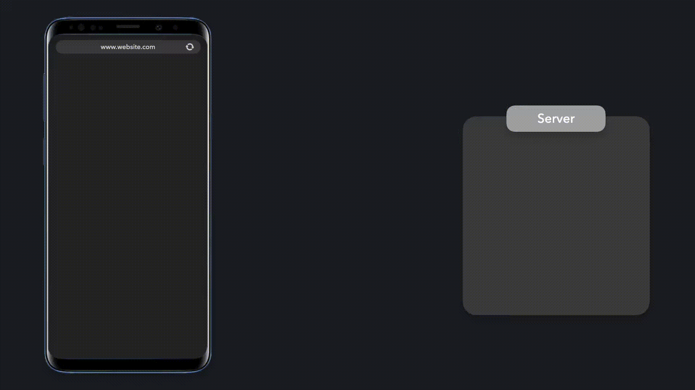
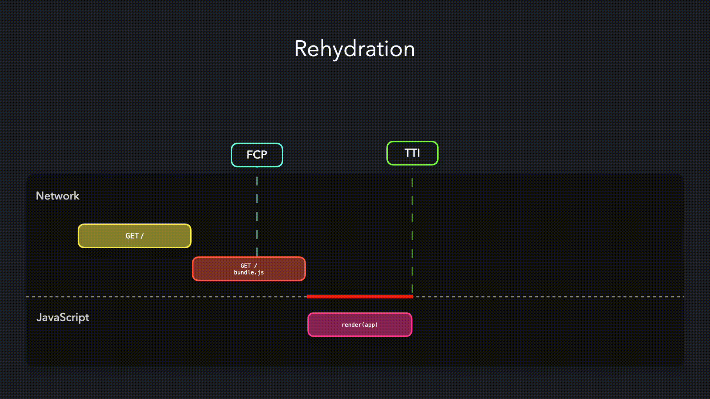
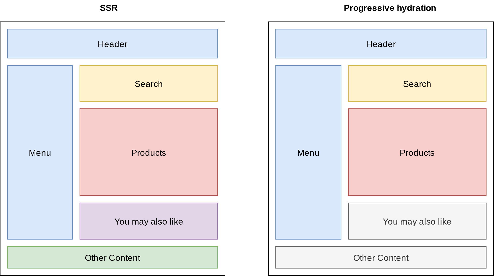

# Progressive Hydration

Trì hoãn việc tải JavaScript cho các phần ít quan trọng trong trang.

- [Triển khai Progressive Hydration](#triển-khai-progressive-hydration)
- [Ưu điểm và nhược điểm](#ưu-điểm-và-nhược-điểm)

---

Một ứng dụng render ở server sử dụng server để tạo HTML cho điều hướng hiện tại. Khi server đã hoàn thành việc tạo nội dung HTML, nó cũng chứa CSS và dữ liệu JSON cần thiết để hiển thị UI tĩnh một cách chính xác và server sẽ gửi dữ liệu đó xuống client. Vì server đã tạo file markup cho chúng ta nên client có thể phân tích cú pháp này và hiển thị nó lên màn hình một cách nhanh chóng tạo ra First Contentful Paint (FCP) nhanh chóng.

Mặc dù render ở server cung cấp một First Contentful Paint nhanh hơn nhưng nó không phải lúc nào nó cũng cung cấp một Time To Interactive (TTI) nhanh hơn. JavaScript cần thiết để có thể tương tác với trang web vẫn chưa được tải. Các button trông như _có thể_ tương tác, nhưng chúng chưa thể tương tác được. Trình xử lý chỉ có thể được gắn vào khi gói JavaScript được tải và xử lý. Quá trình này gọi là _hydration_: React kiểm tra các DOM node hiện tại và hydrate node đó với JavaScript tương ứng.



Thời gian người dùng nhìn thấy UI không tương tác được trên màn hình còn được gọi là uncanny valley: mặc dù người dùng nghĩ rằng họ có thể tương tác với website, nhưng trình xử lý chưa được gắn vào các component. Đây có thể là một trải nghiệm khó chịu với người dùng vì UI trông giống như đang bị đóng băng.

Nó có thể mất một lúc trước khi các DOM component nhận được từ server được hydrate đầy đủ. Trước khi các component có thể được hydrate, file JavaScript cần phải được tải, xử lý và thực thi. Thay vì hydrate toàn bộ trang ứng dụng một lần nhưng chúng ta đã làm trước đó, chúng ta có thể _hydrate dần dần (progressively hydrate)_ các DOM node. Quá trình progressive hydrate làm cho nó có thể hydrate các node riêng lẻ theo thời gian, điều này giúp chỉ request JavaScript cần thiết tối thiểu.


Bằng cách hydrate ứng dụng dần dần, chúng ta có thể trì hoãn quá trình hydrate các phần ít quan trọng hơn của trang. Bằng cách này, chúng ta có thể giảm lượng JavaScript mà chúng ta phải request để làm trang có thể tương tác và chỉ hydrate các node một khi người dùng cần nó. Quá trình hydrate dần dần cũng giúp tránh những vấn đề phổ biến nhất của SSR Rehydration trong đó cây DOM do server render bị huỷ và tạo lại ngay lập tức.



Quá trình hydrate dần dần cho phép chúng ta chỉ hydrate các component dựa trên một điều kiện nhất định, ví dụ khi một component xuất hiện trong khung nhìn (viewport). Trong ví dụ sau, chúng ta có danh sách các người dùng sẽ được hydrate dần dần khi danh sách nằm trong khung nhìn. Một tia màu tím sẽ xuất hiện khi component đã được hydrate.

**client.js**

```jsx
import React from "react";
import { hydrate } from "react-dom";
import App from "./components/App";

hydrate(<App />, document.getElementById("root"));
```

**server.js**

```jsx
import React from "react";
import { renderToNodeStream } from "react-dom/server";
import App from "./components/App";

export default async () => renderToNodeStream(<App />);
```

**App.js**

```jsx
import React from "react";
import { Hydrator as ClientHydrator, ServerHydrator } from "./Hydrator";

let load = () => import("./Stream");
let Hydrator = ClientHydrator;

if (typeof window === "undefined") {
  Hydrator = ServerHydrator;
  load = () => require("./Stream");
}

export default function App() {
  return (
    <div id="app">
      <div className="intro">
        <p>
          This is an example of how server-side rendered React can enable{" "}
          <strong>progressively hydrated</strong> experiences.
        </p>
        <p>
          <strong>Scroll down.</strong> The flash of color you see is an
          indicator of JavaScript being fetched without any direct change to the
          UI.
        </p>
      </div>
      <Hydrator load={load} />
    </div>
  );
}
```

**Hydrator.js**

```jsx
import React from "react";
import ReactDOM from "react-dom";

function interopDefault(mod) {
  return (mod && mod.default) || mod;
}

export function ServerHydrator({ load, ...props }) {
  const Child = interopDefault(load());

  return (
    <section>
      <Child {...props} />
    </section>
  );
}

export function Hydrator(props) {
  const ref = React.useRef(null);

  React.useEffect(() => {
    new IntersectionObserver(async ([entry], obs) => {
      if (!entry.isIntersecting) return;
      obs.unobserve(ref.current);
      const Child = interopDefault(await props.load());
      setTimeout(
        () => ReactDOM.hydrate(<Child {...props} />, ref.current),
        1000
      );
    }).observe(ref.current);
  }, [props]);

  return (
    <section
      ref={ref}
      dangerouslySetInnerHTML={{ __html: "" }}
      suppressHydrationWarning
    />
  );
}
```

**Stream.js**

```jsx
import React, { useRef, useEffect } from "react";
import DATA from "../../data.json";

export default function Stream() {
  const items = DATA.map((user) => ({
    id: user.login.uuid,
    username: user.login.username,
    name: user.name.first + " " + user.name.last,
    avatar: user.picture.medium,
  }));

  return (
    <div className="stream">
      {items.map((profile) => (
        <Profile profile={profile} />
      ))}
    </div>
  );
}

export function Profile({ profile }) {
  const base = useRef();

  useEffect(() => {
    flash(base.current);
  }, []);

  return (
    <div className="list-group-item" ref={base} style={{ color: "red" }}>
      <div className="avatar">
        
      </div>
      <div className="details">
        <div className="info">
          <p className="name" style={{ color: "red" }}>
            {profile.name}
          </p>
          <p className="location">{profile.username}</p>
        </div>
      </div>
    </div>
  );
}

function flash(element) {
  element.style.backgroundColor = "#bd7aff";
  requestAnimationFrame(() => {
    requestAnimationFrame(() => {
      element.style.transition = "background-color 4s ease";
      element.style.backgroundColor = "transparent";
    });
  });
}
```

Mặc dù nó diễn ra nhanh những bạn có thể thấy rằng UI ban đầu giống với UI ở trạng thái hydrate. Vì HTML ban đầu chứa cùng thông tin và style nên chúng ta có thể làm cho component có thể tương tác mà không làm lộn xộn UI. Quá trình hydrate dần dần có thể làm cho component có tính tương tác một cách có điều kiện trong khi điều này hoàn toàn không gây sự chú ý đến người dùng ứng dụng của bạn.

## Triển khai Progressive Hydration

Trong phần triển khai SSR với React, chúng ta đã thảo luận về quá trình hydrate phía client cho một ứng dụng được render trên server. Quá trình hydrate cho phép React phía client nhận ra các ReactDOM component được render trến server và gắn các sự kiện vào các component này. Do đó, nó giới thiệu tính liên tục và liền mạch để ứng dụng SSR hoạt động giống như ứng dụng CSR khi ứng dụng này khả dụng trên client.

Để tất cả component trên một trang có thể tương tác thông qua quá trình hydrate, React code của các component này phải có trong gói mà được tải xuống client. Các SPA tương tác cao được kiểm soát một phần lớn bởi JavaScript sẽ cần toàn bộ gói một lúc. Tuy nhiên, hầu hết các trang web tĩnh với một vài thành phần tương tác trên màn hình, có thể không cần tất cả các component hoạt động ngay lập tức. Đối với những trang web như vậy, việc gửi một gói React khổng lồ cho mỗi component trên màn hình trở thành tải phí khồng cần thiết (overhead).

Progressive Hydration giải quyết vấn đề này bằng cách cho phép chúng ta hydrate một số phần nhất định của ứng dụng khi đang tải trang. Những phần khác sẽ được hydrate dần dần theo yêu cầu.



Với quá trình hydrate dần dần, các component "_You may also like_" và "_Other Content_" có thể được hydrate sau.

Thay vì khởi tạo toàn bộ ứng dụng cùng một lúc, quá trình hydrate bắt đầu từ gốc của cây DOM nhưng các phần riêng lẻ của ứng dụng được render bởi server sẽ được kích hoạt trong một khoảng thời gian. Quá trình hydrate có thể bị dừng đối với các nhánh khác nhau và được tiếp tục lại khi chúng vào viewport hoặc dựa trên một vài trigger khác. Lưu ý rằng, việc tải các tài nguyên cần thiết để thực hiện mỗi quá trình hydrate cũng được hoãn lại bằng cách sử dụng kỹ thuật phân tách code, do đó giảm lượng JavaScript cần thiết để làm cho các trang có thể tương tác.

Ý tưởng đằng sau progressive hydration là mang lại hiệu suất tuyệt vời bằng cách kích hoạt ứng dụng của bạn theo từng khối. Bất kỳ giải pháp progressive hydration cũng nên tính đến việc nó sẽ tác động như thế nào đến trải nghiệm người dùng tổng thể. Bạn không thể có các đoạn màn hình hiện lên lần lượt nhưng chặn bất kỳ hoạt động hay đầu vào của người dùng trên các đoạn đã được tải. Vì vậy các yêu cầu để triển khai một progressive hydration toàn diện như sau:

1. Cho phép sử dụng SSR cho tất cả component.
2. Hỗ trợ phần tách code thành các thành phần hoặc khối riêng lẻ.
3. Hỗ trợ quá trình hydrate phía client của các khối này theo trình tự do developer xác định.
4. Không được chặn đầu vào của người dùng trên các khối đã được hydrate.
5. Cho phép sử dụng một số loại loading cho các khối có quá trình hydrate bị trì hoãn.

[React concurrent mode](https://17.reactjs.org/docs/concurrent-mode-patterns.html) sẽ giải quyết tất cả yêu cầu này khi nó có sẵn tất cả. Nó cho phép React làm việc trên các tác vụ khác nhau cùng lúc và chuyển đổi giữa chúng dựa trên mức độ ưu tiên. Khi chuyển đổi, một phần đã render của cây không cần phải được commit vì vậy tác vụ render có thể tiếp tục khi React chuyển trở lại cùng một tác vụ.

Concurrent mode có thể được sử dụng để triển khai progressive hydration. Trong trường hợp này, hydrate từng khối trên trang, trở thành một tác vụ cho React concurrent mode. Nếu một tác vụ có độ ưu tiên cao hơn như đầu vào của người dùng cần phải được thực hiện, React sẽ tạm ngưng tác vụ hydrate và chuyển sang chấp nhận đầu vào của người dùng. Các tính năng như [**lazy()**](https://react.dev/reference/react/lazy), [**Suspense()**](https://react.dev/reference/react/Suspense) cho phép bạn sử dụng khai báo các trạng thái loading. Chúng có thể được sử dụng để hiển thị thanh loading khi các khối đang được lazy loading. SuspenseList() có thể được sử dụng để xác định mức độ ưu tiên cho các component được lazy loading. Demo [**này**](https://codesandbox.io/s/floral-worker-xwbwv) được chia sẻ bởi [**Dan Abramov**](https://twitter.com/dan_abramov/status/1200111677833973760) cho thấy concurrent mode hoạt động và triển khai progressive hydration.

React concurrent mode cũng có thể được kết hợp với một tính năng React khác

- [**Server Components**](https://github.com/reactjs/rfcs/blob/bf51f8755ddb38d92e23ad415fc4e3c02b95b331/text/0000-server-components.md). Điều này cho phép bạn fetch các component từ server và render chúng trên client ngay cả khi dữ liệu đang stream từ server đến thay vì phải đợi toàn bộ quá trình fetch kết thúc. Do đó, CPU của client được đưa vào hoạt động ngay khi chúng ta đợi kết thúc quá trình fetch.

Trong khi việc triển khai progressive hydration dựa trên React concurrent mode vẫn đang trong quá trình hoàn thiện thì nhiều ứng viên khác cho việc triển khai hydrate một phần đã có sẵn. Progressive hydration đã được trình diễn tại [**Google I/O '19**](https://www.youtube.com/watch?v=k-A2VfuUROg&t=960s). [**Bản demo cho progressive hydration**](https://github.com/GoogleChromeLabs/progressive-rendering-frameworks-samples/tree/master/react-progressive-hydration) cho thấy việc sử dụng Hydrator component để hydrate các phần được chọn của trang. Nhiều triển khai đã sinh ra từ điều này cho các framework client-side khác nhau. Việc triển khai cũng có trên Vue, Angular và Next.js.

Hãy xem nhanh một phương pháp như vậy bằng cách sử dụng Preact và Next.js

[**Đây**](https://github.com/LukasBombach/next-super-performance) là một ví dụ thực tế cho quá trình hydrate một phần sử dụng:

1. `pool-attendant-preact`: Một thư viện triển khai hydrate một phần với Preact X.

2. `next-super-performance`: Một plugin Next.js sử dụng thư viện này để cải thiện hiệu suất phía client.

Thư viện `pool-attendant-preact` bao gồm một API có tên `withHydration` cho phép bạn đánh dấu các component tương tác nhiều hơn để hydrate. Những thứ này được hydrate trước. Bạn có thể sử dụng điều này để xác định nội dung trang của bạn như sau.

```jsx
import Teaser from "./teaser";
import { withHydration } from "next-super-performance";

const HydratedTeaser = withHydration(Teaser);

export default function Body() {
  return (
    <main>
      <Teaser column={1} />
      <HydratedTeaser column={2} />
      <HydratedTeaser column={3} />

      <Teaser column={1} />
      <Teaser column={2} />
      <Teaser column={3} />

      <Teaser column={1} />
      <Teaser column={2} />
      <Teaser column={3} />
    </main>
  );
}
```

Component `HydratedTeaser` trong trong cột 2 và 3 sẽ được hydrate trước. Giờ đây bạn có thể hydrate các component còn lại trên client bằng cách sử dụng API `hydrate()` cũng được bao gồm trong thư viện.

```js
import { hydrate } from "next-super-performance";
import Teaser from "./components/teaser";

hydrate([Teaser]);
```

Component `HydrationData` được sử dụng để ghi các serialized props cho client. Nó sẽ đảm bảo rằng các props cần thiết sẽ có sẵn cho các component được hydrate.

```jsx
import Header from "../../components/header";
import Main from "../../components/main";
import { HydrationData } from "next-super-performance";

export default function Home() {
  return (
    <section>
      <Header />
      <Main />
      <HydrationData />
    </section>
  );
}
```

## Ưu điểm và nhược điểm

Progressive hydration cung cấp render phía server và hydrate phía client đồng thời giảm thiểu tài nguyên hydrate. Sau đó là một số lợi ích có thể đạt được từ điều này.

1. **Khuyến khích phân tách code**: Phân tách code là một phần không thể thiếu của progressive hydration bởi vì các khối code cần được tạo cho các component riêng lẻ để lazy loading.

2. **Cho phép tải theo yêu cầu đối với các phần không sử dụng thường xuyên của trang**: Có thể các component của trang chủ yếu là tĩnh, nằm ngoài viewport và/hoặc không được yêu cầu thường xuyên. Các component như vậy là ứng viên lý tưởng cho lazy loading. Hydrate code của các thành phần này không cần được gửi khi tải trang. Thay vào đó, chúng có thể được hydrate dựa trên một trigger.

3. **Giảm kích thước gói**: Tự động phân tách code dẫn đến việc giảm kích thước gói. Ít code hơn để thực thi khi tải giúp giảm thời gian giữa FCP và TTI.

Mặt khác, progressive hydration có thể không phù hợp với các ứng dụng động trong đó mọi thành phần trên màn hình đều có sẵn cho người dùng và cần được thực hiện tương tác khi tải. Điều này là do nếu các developer không biết người dùng có khả năng nhấn vào đâu trước thì họ có thể không xác định được thành phần nào cần hydrate trước.
