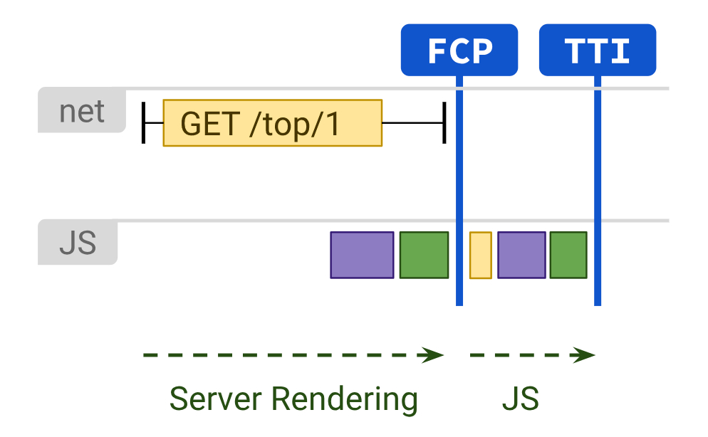

# Server-side Rendering

Tạo HTML trên server để hiển thị theo yêu cầu của người dùng.

- [Triển khai SSR theo cách cổ điển](#triển-khai-ssr-theo-cách-cổ-điển)
- [Ưu điểm và nhược điểm](#ưu-điểm-và-nhược-điểm)
  - [Ít JavaScript hơn dẫn đến FCP và TTI nhanh hơn](#ít-javascript-hơn-dẫn-đến-fcp-và-tti-nhanh-hơn)
  - [Tối ưu hoá JavaScript phía client](#tối-ưu-hoá-javascript-phía-client)
  - [Khả năng SEO](#khả-năng-seo)
  - [TTFB chậm](#ttfb-chậm)
  - [Cần tải lại toàn bộ trang đối với một số tương tác](#cần-tải-lại-toàn-bộ-trang-đối-với-một-số-tương-tác)
- [SSR với Next.js](#ssr-với-nextjs)
- [React cho server](#react-cho-server)

---

Server-side rendering (SSR) là một trong những phương thức render nội dung web lâu đời nhất. SSR tạo ra HTML chứa đầy đủ toàn bộ nội dung trang theo yêu cầu của người dùng. Nội dung có thể bao gồm dữ liệu từ kho dữ liệu hoặc API bên ngoài.


Các hoạt động kết nối và fetch được xử lý trên server. HTML cần thiết để định dạng nội dung cũng được tạo trên server. Do đó, với SSR chúng ta có thể tránh được việc thêm các yêu cầu đến server để fetch dữ liệu và tạo template (templating). Như vậy, rendering code không bắt buộc trên client và JavaScript tương ứng với đoạn code này cũng không cần gửi tới client.

Với SSR, mọi request được xử lý độc lập và sẽ được server xử lý như một request mới. Ngay cả khi output của hai request liên tục không khác nhau lắm, server vẫn sẽ xử lý yêu cầu đó lại từ đầu. Bởi vì server là cho nhiều người dùng chung nên khả năng xử lý được chia sẻ cho tất cả người dùng đang hoạt động tại cùng một thời điểm.

## Triển khai SSR theo cách cổ điển

Hãy cho chúng tôi xem cách bạn tạo một trang để hiển thị thời gian hiện tại bằng cách sử dụng SSR và JavaScript cổ điển.

**index.html**

```html
<!DOCTYPE html>
<html>
  <head>
    <title>Time</title>
  </head>
  <body>
    <div>
      <h1>Hello, world!</h1>
      <b
        >It is
        <div id="currentTime"></div
      ></b>
    </div>
  </body>
</html>
```

**index.js**

```js
function tick() {
  var d = new Date();
  var n = d.toLocaleTimeString();
  document.getElementById("currentTime").innerHTML = n;
}
setInterval(tick, 1000);
```

Chú ý đoạn code này khác với CSR cung cấp cùng một output như thế nào. Cũng xin lưu ý rằng, trong khi HTML được hiển thị bởi server, thời gian ở đây được hiển thị là giờ địa phương trên client được xác định bởi hàm JavaScript `tick()`. Nếu bạn muốn hiển thị bất kỳ dữ liệu nào khác dành riêng cho server chẳng hạn như thời gian của server, bạn sẽ cần nhúng dữ liệu đó vào HTML trước khi nó được render. Điều này có nghĩa nó sẽ không được làm mới tự động mà không gửi yêu cầu đến server.

## Ưu điểm và nhược điểm

Việc thực thi code render trên server và giảm JavaScript mang lại những lợi ích sau

### Ít JavaScript hơn dẫn đến FCP và TTI nhanh hơn

Trong trường hợp có nhiều UI element và logic ứng dụng trên cùng một trang, SSR có ít JavaScript hơn đáng kể so với CSR. Do đó thời gian cần thiết để tải và xử lý script cũng sẽ ngắn hơn. FP, FCP, TTI ngắn hơn và FCP = TTI. Với SSR, người dùng sẽ không phải chờ đợi tất cả thành phần trên màn hình xuất hiện và chờ đợi cho nó có thể tương tác.



### Tối ưu hoá JavaScript phía client

Các nhóm phát triển được yêu cầu làm việc với một JavaScript budget giới hạn số lượng JavaScript trên một trang để đạt được hiệu suất mong muốn. Với SSR, vì bạn đã trực tiếp loại bỏ được JavaScript cần thiết để render trang nó tạo thêm không gian cho bất kỳ JavaScript bên thứ ba nào mà ứng dụng cần.

### Khả năng SEO

Các trình thu thập của các công cụ tìm kiếm có thể dễ dàng thu thập nội dung của ứng dụng SSR, do đó đảm bảo SEO cao hơn trên trang.

SSR hoạt động tốt với những nội dung tĩnh do những ưu điểm trên. Tuy nhiên, nó có vài nhược điểm vì nó không hoàn hảo cho mọi tình huống.

### TTFB chậm

Vì tất cả quá trình xử lý diễn ra trên server nên quá trình phản hồi từ server có thể bị chậm trong một hoặc nhiều tình huống sau:

- Nhiều người dùng đồng thời gây quá tải server.
- Mạng yếu
- Code server chưa tối ưu

### Cần tải lại toàn bộ trang đối với một số tương tác

Vì tất cả code không có sẵn ở client nên cần phải gửi yêu cầu đến server đối với những thao tác chính gây ra tải lại toàn bộ trang. Điều này có thể tăng thời gian giữa các lần tương tác vì người dùng phải đợi lâu hơn giữa các lần thao tác. Do đó single-page application không thể thực hiện với SSR.

Để giải quyết những nhược điểm này, các framework và thư viện hiện đại cho phép render trên cả server và client trong cùng một ứng dụng. Chúng ta sẽ đâu sâu vào chi tiết những điều này trong các phần sau. Đầu tiên, hãy xem xét một dạng SSR đơn giản hơn với Next.js.

## SSR với Next.js

Next.js framework cũng hỗ trợ SSR. Nó sẽ render trước một trang trên server mỗi request. Nó có thể được thực hiện bằng cách export một async function có tên là [`getServerSideProps()`](https://nextjs.org/docs/pages/building-your-application/data-fetching#getserversideprops-server-side-rendering) từ một trang như sau:

```js
export async function getServerSideProps(context) {
  return {
    props: {}, // sẽ được truyền xuống page component như một props
  };
}
```

`context` object chứa key cho HTTP request và response object, tham số routing, querystring, locale,...

Việc triển khai sau đây cho thấy việc sử dụng `getServerSideProps()` để hiển thị dữ liệu trên trang được định dạng bằng React.

**users/page.jsx**

```jsx
//fetch dữ liệu từ nguồn dữ liệu bên ngoài sử dụng `getServerSideProps`

const Users = ({ users, error }) => {
  return (
    <section>
      <header>
        <h1>List of users</h1>
      </header>
      {error && <div>There was an error.</div>}
      {!error && users && (
        <table>
          <thead>
            <tr>
              <th>Username</th>
              <th>Email</th>
              <th>Name</th>
            </tr>
          </thead>
          <tbody>
            {users.map((user, key) => (
              <tr key={key}>
                <td>{user.username}</td>
                <td>{user.email}</td>
                <td>{user.name}</td>
              </tr>
            ))}
          </tbody>
        </table>
      )}
    </section>
  );
};

export async function getServerSideProps() {
  // Fetch dữ liệu từ API bên ngoài
  const res = await fetch("https://jsonplaceholder.typicode.com/users");
  const data = await res.json();

  // Truyền dữ liệu xuống page như một props
  return { props: { data } };
}

export default Users;
```

## React cho server

React có thể isomorphic rendering, có nghĩa là nó có thể hoạt động trên cả trình duyệt cũng như server. Do đó các UI element có thể được render trên server bằng React.

React có thể sử dụng với universal code điều này cho phép cùng một đoạn code chạy trong nhiều môi trường. Điều này có thể được bằng cách sử dụng Node.js trên server hay còn được biết đến là Node server. Do đó universal JavaScript có thể được dùng để fetch dữ liệu trên server và sau đó render nó bằng cách sử dụng isomorphic React.

Chúng ta hãy xem qua các hàm React giúp thực hiện điều này.

```jsx
ReactDOMServer.renderToString(element);
```

Function này trả về chuỗi HTML tương ứng với React element. Sau đó HTML có thể được render ở client để tải trang nhanh hơn.

Function [`renderToString()`](https://react.dev/reference/react-dom/server/renderToString) có thể được sử dụng với [ReactDOM.hydrate()](https://react.dev/reference/react-dom/hydrate). Điều này đảm bảo rằng HTML đã được render giữ nguyên hiện trạng trên client và chỉ các event handler được đính kèm sau khi tải.

Để thực hiện điều này, chúng ta sử dụng file `.js` trên cả client và server tương ứng với mọi trang. File `.js` trên server sẽ render nội dung HTML và file `.js` trên client sẽ hydrate nó.

Giả sử bạn có một React element được gọi là `App` chứa HTML để render được khai báo trong universal file `app.js`. Cả server và client-side React có thể nhận ra `App` element.

File `ipage.js` trên server có mã:

```js
app.get("/", (req, res) => {
  const app = ReactDOMServer.renderToString(<App />);
});
```

Hằng `App` bây giờ có thể sử dụng để tạo ra HTML để render. `ipage.js` ở phía client sẽ có những code sau đây để đảm bảo element `App` được hydrate.

```js
ReactDOM.hydrate(<App />, document.getElementById("root"));
```

Bạn có thể tìm một ví dụ đầy đủ về SSR với React tại [đây](https://www.digitalocean.com/community/tutorials/react-server-side-rendering)
