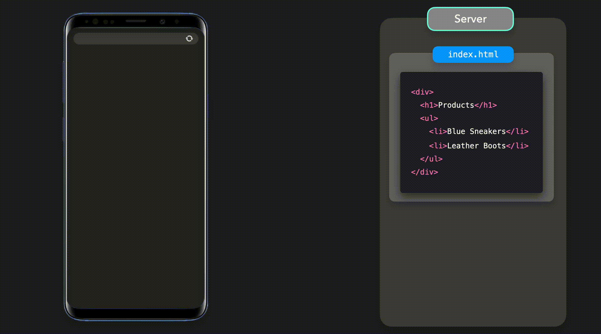
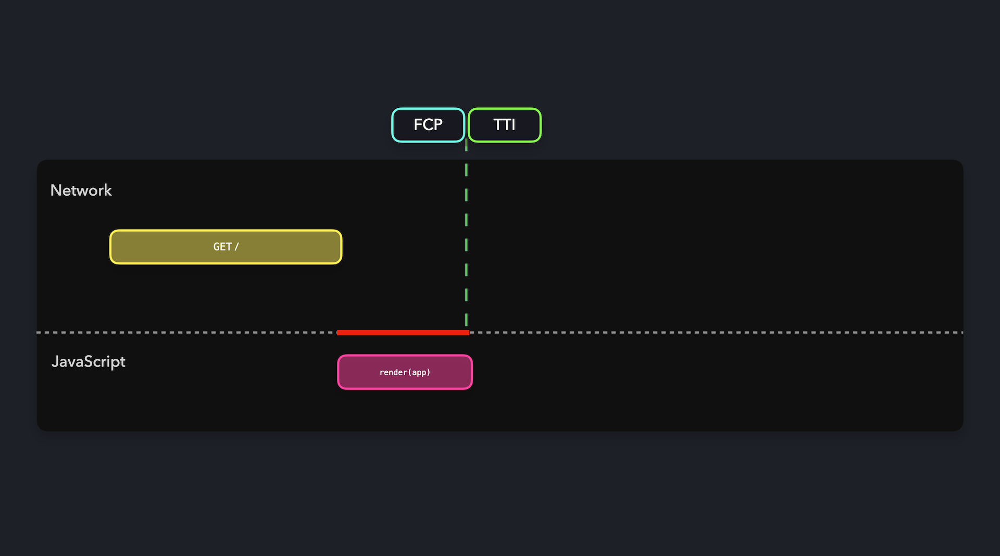

# Static Rendering

Cung cấp nội dung HTML render sẵn được tạo khi build trang web.

- [Cấu trúc cơ bản](#cấu-trúc-cơ-bản)
- [SSG với dữ liệu](#ssg-với-dữ-liệu)
  - [Trang danh sách - Tất cả các mục](#trang-danh-sách---tất-cả-các-mục)
  - [Trang chi tiết - Mỗi mục riêng lẻ](#trang-chi-tiết---mỗi-mục-riêng-lẻ)
- [SSG - Những cân nhắc chính](#ssg---những-cân-nhắc-chính)

---

Dựa trên thảo luận của chúng ta về SSR, chúng ta biết rằng thời gian xử lý request lâu trên server sẽ ảnh hưởng tiêu cực đến TTFB. Tương tự với CSR, một gói JavaScript kích thước lớn có thể gây bất lợi cho FCP, LCP và TTI của ứng dụng do mất nhiều thời gian để tải xuống và xử lý script.

Static rendering hay static generation (SSG) cố gắng giải quyết các vấn đề này bằng cách cung cấp nội dung HTML được render sẵn khi website được build tới client.


Một file HTML tĩnh được tạo trước tương ứng với từng route mà người dùng có thể truy cập. Những file HTML tĩnh này có thể có sẵn trên server hoặc một CDN và được tải xuống theo yêu cầu của client.



Các static file cũng có thể được cache do đó cung cấp khả năng phục hồi và chịu tải cao hơn. Do reponse HTML được tạo trước nên thời gian xử lý trên server không đáng kể dẫn đến TTFB nhanh hơn và hiệu suất tốt hơn. Trong một kịch bản lý tưởng, JavaScript ở phía client sẽ ở mức tối thiểu và trang tĩnh sẽ tương tác được ngay sau khi client nhận được response. Do đó, SSG giúp đạt được FCP/TTI nhanh hơn.



## Cấu trúc cơ bản

Như cái tên, static render là lý tưởng cho nội dung tĩnh, trong đó không cần được tuỳ chỉnh dựa trên người dùng đã đăng nhập (ví dụ: đề xuất cá nhân hoá). Do đó những trang tĩnh như '_Về chúng tôi_', '_Liên hệ_', '_Bài viết_' dành cho website hay trang sản phẩm dành cho ứng dụng thương mại điện tử là những ứng viên lý tưởng cho static rendering. Các framework như Next.js, Gastby và VuePress hỗ trợ static generation. Để chúng tôi bắt đầu với [**ví dụ Next.js**](https://vercel.com/blog/nextjs-server-side-rendering-vs-static-generation#about-us-page-static-generation-without-data) đơn giản này về render nội dung tĩnh mà không cần bất kỳ dữ liệu nào.

**Next.js:**

```js
// pages/about.js

export default function About() {
  return (
    <div>
      <h1>About Us</h1>
      {/* ... */}
    </div>
  );
}
```

Khi trang web được build (sử dụng `next build`), trang này sẽ được render trước thành một file `about.html` có thể truy cập tại route `/about`.

## SSG với dữ liệu

Nội dung tĩnh như trong các trang 'Về chúng tôi' hay 'Liên hệ với chúng tôi' có thể được render mà không cần dữ liệu từ kho dữ liệu. Tuy nhiên, những nội dung như các trang bài viết và trang sản phẩm, dữ liệu từ kho dữ liệu sẽ được kết hợp với một template cụ thể và sau đó được render thành HTML khi build.

Số lượng trang HTML được tạo sẽ phụ thuộc vào số lượng bài viết hay số lượng sản phẩm tương ứng. Để truy cập những trang này, bạn cũng sẽ có các trang để chứa danh sách, đó là những trang HTML chứa danh sách các dữ liệu được phân loại và định dạng. Các tình huống này có thể được giải quyết bằng cách sử dụng Next.js static rendering. Chúng ta có thể tạo các trang danh sách hoặc trang chi tiết cụ thể dựa trên các mục có sẵn.

### Trang danh sách - Tất cả các mục

Tạo trang danh sách là một kịch bản trong đó nội dung được hiển thị trên trang phụ thuộc vào dữ liệu bên ngoài. Dữ liệu này sẽ được fetch từ database khi build để xây dựng trang. Trong Next.js điều này có thể đạt được bằng cách export function `getStaticProps()` trong page component. Function này sẽ được gọi khi build trên build server để fetch dữ liệu. Dữ liệu sau đó có thể được truyền xuống trang là một `props` để render trước page component. Chúng ta hãy xem qua code để tạo một trang danh sách sản phẩm cái mà ban đầu được chia sẻ như một phần của [**bài viết này**](https://vercel.com/blog/nextjs-server-side-rendering-vs-static-generation#all-products-page-static-generation-with-data)

```js
// Function này chạy khi build trên build server
export async function getStaticProps() {
  return {
    props: {
      products: await getProductsFromDatabase(),
    },
  };
}

// Page component nhận products prop từ getStaticProps khi build
export default function Products({ products }) {
  return (
    <>
      <h1>Products</h1>
      <ul>
        {products.map((product) => (
          <li key={product.id}>{product.name}</li>
        ))}
      </ul>
    </>
  );
}
```

Function này sẽ không được bao gồm gói JavaScript phía client và thậm chí có thể được sử dụng để fetch dữ liệu trực tiếp từ database.

### Trang chi tiết - Mỗi mục riêng lẻ

Trong ví dụ trên, chúng ta có thể có một trang chi tiết dành cho từng sản phẩm được liệt kê trong trang danh sách sản phẩm. Những trang này có thể được truy cập bằng cách click vào các mục tương ứng trong trang danh sách hoặc trực tiếp thông qua một số route.

Giả sử chúng ta có các sản phẩm với id 101, 102, 103 và nhiều nữa. Chúng ta cần thông tin của chúng phải có sẵn tại các route `/products/101`, `/products/102`, `/products/103`,... Để đạt được điều này khi build trong Next.js chúng ta có thể sử dụng function `getStaticPaths()` kết hợp với [**dynamic routes**](https://nextjs.org/docs/pages/building-your-application/routing/dynamic-routes).

Chúng ta cần tạo một page component chung `products/[id].js` cho nó và export function `getStaticPaths()` bên trong nó. Function này sẽ trả về tất cả id sản phẩm có thể được sử dụng để render trước các trang chi tiết sản phẩm khi build. Next.js skeleton có ở [**đây**](https://vercel.com/blog/nextjs-server-side-rendering-vs-static-generation#individual-product-page-static-generation-with-data) cho biết cách xây dựng code làm điều này.

```js
// pages/products/[id].js

// Trong getStaticPaths(), bạn cần trả về danh sách id
// của các trang sản phẩm (/products/[id]) mà bạn muốn
// render trước tại lúc build. Để làm vậy, bạn có thể
// fetch dữ liệu tất cả sản phẩm từ database.
export async function getStaticPaths() {
  const products = await getProductsFromDatabase();

  const paths = products.map((product) => ({
    params: { id: product.id },
  }));

  // fallback: false nghĩa là các trang không có id chính xác sẽ là 404
  return { paths, fallback: false };
}

// params sẽ chứa id cho mỗi trang được tạo.
export async function getStaticProps({ params }) {
  return {
    props: {
      product: await getProductFromDatabase(params.id),
    },
  };
}

export default function Product({ product }) {
  // Render sản phẩm
}
```

Chi tiết trên trang sản phẩm có thể được điền vào khi build bằng cách sử dụng function `getStaticProps()` cho id sản phẩm cụ thể. Chú ý việc sử dụng `fallback: false` tại đây có nghĩa là nếu một trang không có sẵn ứng với một route hay một id sản phẩm cụ thể, trang 404 sẽ được hiển thị.

Do đó chúng ta có thể sử dụng SSG để render trước nhiều loại trang khác nhau.

## SSG - Những cân nhắc chính

Như đã thảo luận, SSG mang lại hiệu suất tuyệt vời cho website vì nó cắt giảm quá trình xử lý cần thiêt cho cả server và client. Các trang web cũng thân thiện với SEO vì nội dung đã có sẵn và có thể được render bởi trình thu thập dữ liệu mà không cần làm thêm gì. Mặc dù hiệu suất và SEO làm cho SSG là một render pattern tuyệt vời, các yếu tốt sau cần được cân nhắc khi đánh giá mức độ phù họp của SSG đối với các ứng dụng cụ thể.

1. **Số lượng file HTML lớn**: Các file HTML riêng lẻ cần được tạo cho tất cả route mà người dùng có thể truy cập. Ví dụ khi sử dụng nó cho một blog, một file HTML sẽ được tạo cho mỗi bài viêt trong kho dữ liệu. Sau đó, các chỉnh sửa đối với bất kỳ bài đăng nào đều sẽ yêu cầu build lại để cập nhật lại các file HTML tĩnh. Việc duy trì một số lượng lớn file HTML sẽ làm một thử thách.

2. **Phụ thuộc hosting**: Để một trang web SSG trở nên siêu nhanh và phản hồi nhanh chóng, nền tảng hosting dùng để lưu trữ và cung cấp file HTML cũng phải tốt. Có thể đạt hiệu suất cao nếu một trang web SSG tốt được lưu trữ trên nhiều CDN để tận dụng lợi thế của edge-caching.

3. **Nội dung động**: Một trang web SSG cần được build và deploy lại mỗi lần nội dung thay đổi. Nội dung sẽ là nội dung cũ nếu trang web không được build và deploy lại sau mỗi lần nội dung thay đổi. Điều này làm cho SSG không phù hợp với nội dung động.
