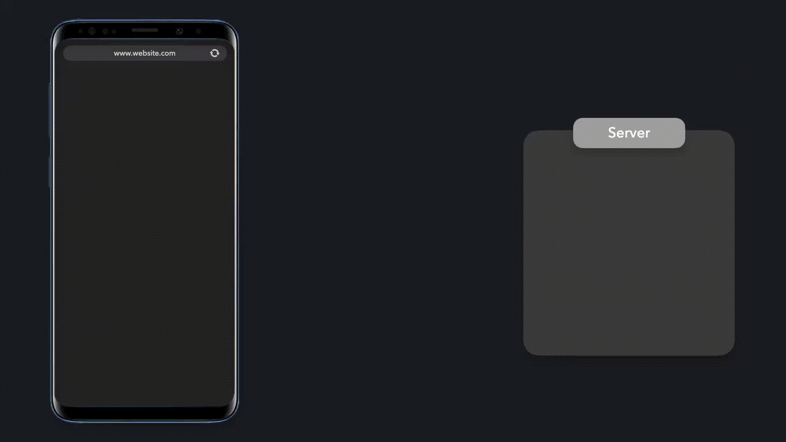
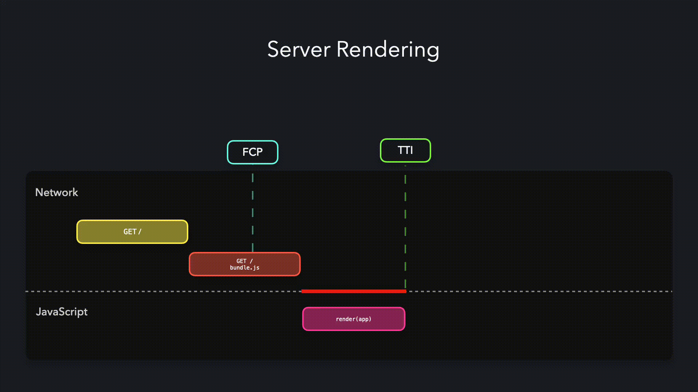
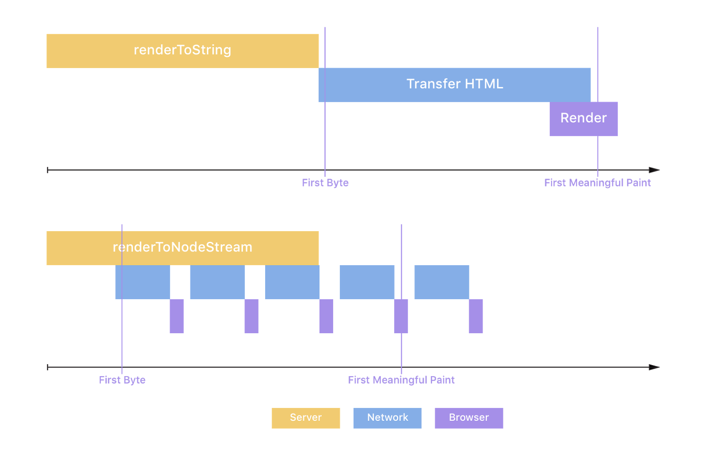

# Streaming Server-Side Rendering

Tạo HTML được render trên server theo yêu cầu của người dùng.

- [Các khái niệm](#các-khái-niệm)
- [React hỗ trợ Streaming](#react-hỗ-trợ-streaming)
- [Streaming SSR - Ưu và nhược](#streaming-ssr---ưu-và-nhược)

---

Chúng ta có thể giảm Time To Interactive (TTI) trong khi vẫn render ứng dụng của bạn ở server bằng cách _streaming server rendering_ nội dung của ứng dụng của chúng ta. Thay vì tạo một file HTML lớn chứa markup cần thiết cho điều hướng hiện tại, chúng ta có thể chia thành những phần nhỏ hơn! Node streams cho phép chúng ta stream dữ liệu vào response object, có nghĩa là chúng ta có thể liên tục gửi dữ liệu xuống client. Thời điểm mà client nhận được các khối dữ liệu, nó có thể bắt đầu hiển thị nội dung.



`renderToNodeStream ` tích hợp sẵn trong React giúp chúng ta có thể gửi ứng dụng của mình theo các phần nhỏ hơn. Vì client có thể bắt đầu vẽ giao diện khi nó vẫn đang nhận dữ liệu nên chúng ta có thể tạo ra trải nghiệm tải lần đầu rất hiệu quả.

Việc gọi phương thức `hydrate` trên các DOM node đã nhận sẽ gắn các trình xử lý sự kiện tương ứng giúp UI có thể tương tác.



Giả sử chúng ta có một ứng dụng hiển thị cho người dùng hàng ngàn thông tin về mèo trong `App` component.

**server.js**

```js
import React from "react";
import path from "path";
import express from "express";
import { renderToNodeStream } from "react-dom/server";

import App from "./src/App";

const app = express();

app.get("/favicon.ico", (req, res) => res.end());
app.use("/client.js", (req, res) => res.redirect("/build/client.js"));

const DELAY = 500;
app.use((req, res, next) => {
  setTimeout(() => {
    next();
  }, DELAY);
});

const BEFORE = `
<!DOCTYPE html>
  <html>
    <head>
      <title>Cat Facts</title>
      <link rel="stylesheet" href="/style.css">
      <script type="module" defer src="/build/client.js"></script>
    </head>
    <body>
      <h1>Stream Rendered Cat Facts!</h1>
      <div id="approot">
`.replace(/
s*/g, "");

app.get("/", async (request, response) => {
  try {
    const stream = renderToNodeStream(<App />);
    const start = Date.now();

    stream.on("data", function handleData() {
      console.log("Render Start: ", Date.now() - start);
      stream.off("data", handleData);
      response.useChunkedEncodingByDefault = true;
      response.writeHead(200, {
        "content-type": "text/html",
        "content-transfer-encoding": "chunked",
        "x-content-type-options": "nosniff"
      });
      response.write(BEFORE);
      response.flushHeaders();
    });
    await new Promise((resolve, reject) => {
      stream.on("error", err => {
        stream.unpipe(response);
        reject(err);
      });
      stream.on("end", () => {
        console.log("Render End: ", Date.now() - start);
        response.write("</div></body></html>");
        response.end();
        resolve();
      });
      stream.pipe(
        response,
        { end: false }
      );
    });
  } catch (err) {
    response.writeHead(500, {
      "content-type": "text/pain"
    });
    response.end(String((err && err.stack) || err));
    return;
  }
});

app.use(express.static(path.resolve(__dirname, "src")));
app.use("/build", express.static(path.resolve(__dirname, "build")));

const listener = app.listen(process.env.PORT || 2048, () => {
  console.log("Your app is listening on port " + listener.address().port);
});
```

`App` component được stream rendered sử dụng phương thức `renderToNodeStream` tích hợp sẵn. HTML ban đầu được gửi đến response object cùng với các khối dữ liệu từ `App` component.

**index.html**

```html
<!DOCTYPE html>
<html>
  <head>
    <title>Cat Facts</title>
    <link rel="stylesheet" href="/style.css" />
    <script type="module" defer src="/build/client.js"></script>
  </head>
  <body>
    <h1>Stream Rendered Cat Facts!</h1>
    <div id="approot"></div>
  </body>
</html>
```

Dữ liệu này chứa thông tin hữu ích mà ứng dụng của chúng ta cần dùng để render nội dung một cách chính xác, chẳng hạn như `title` của trang và `stylesheet`. Nếu chúng ta để server render `App` component bằng phương thức `()` sang `renderToNodeStream()` Có những trường hợp code hoạt động với SSR có thể không hoạt động với streaming. Sau đây là một số ví dụ mà migrate có thể không dễ dàng.

1. Các framework sử dụng server-side-pass để tạo markup cần được thêm vào document trước được render trên server. Ví dụ các framework xác định động CSS nào sẽ được thêm vào trang trong thẻ , chúng ta sẽ phải đợi cho đến khi ứng dụng nhận được tất cả dữ liệu trước khi bắt đầu tải và xử lý dữ liệu này. Để tăng tốc độ, `renderToNodeStream` giúp ứng dụng có thể bắt đầu tải và xử lý thông tin này khi ứng dụng vẫn đang nhận các khối dữ liệu này từ `App` component.

> Để xem thêm các ví dụ về triển khai Progressive Hydration và Server Rendering, hãy ghé qua [**GitHub repo này**](https://github.com/GoogleChromeLabs/progressive-rendering-frameworks-samples)

## Các khái niệm

Giống như progressive hydration, streaming là một cơ chế render khác có thể được sử dụng để cải thiện hiệu suất SSR. Như tên gọi của nó, streaming ngụ ý các khối HTML được truyền trực tiếp từ node server đến client khi chúng được tạo. Bởi vì client bắt đầu nhận những "byte" HTML sớm hơn ngay cả khi đối với các trang lớn, TTFB giảm đáng kể và tương đối ổn định. Tất cả trình duyệt phổ biến hiện nay bắt đầu phân tích cú pháp và render nội dung stream hoặc một phần response sớm hơn. Bởi vì render dần dần, kết quả là FP và FCP nhanh.

Streaming đáp ứng tốt với trình trạng mạng quá tải (network backpressure). Nếu mạng bị tắc và không thể truyền thêm bất kỳ byte nào, trình render sẽ nhận được tín hiệu và dừng streaming cho đến khi nào mạng thông. Do đó server sử dụng ít bộ nhớ hơn và phản hồi nhanh hơn với các điều kiện I/O.
Điều này cho phép server Node.js của bạn render nhiều request cùng một lúc và ngăn các request nặng hơn chặn các request nhẹ hơn một khoảng thời gian dài. Kết quả là trang web luôn phản hồi ngay cả trong những điều kiện khó khăn.

## React hỗ trợ Streaming

React được giới thiệu hỗ trợ streaming trong React 16 phát hành năm 2016. Các API sau được đưa vào ReactDOMServer để hỗ trợ streaming.

1. [**`ReactDOMServer.renderToNodeStream(element)`**](https://react.dev/reference/react-dom/server/renderToNodeStream): HTML đầu ra của hàm này cũng giống như [\*\*`ReactDOMServer.()( sang `renderToNodeStream()` Có những trường hợp code hoạt động với SSR có thể không hoạt động với streaming. Sau đây là một số ví dụ mà migrate có thể không dễ dàng.

1. Các framework sử dụng server-side-pass để tạo markup cần được thêm vào document trước được render trên server. Ví dụ các framework xác định động CSS nào sẽ được thêm vào trang trong thẻ element)`**](<https://react.dev/reference/react-dom/server/()>) sang `renderToNodeStream()` Có những trường hợp code hoạt động với SSR có thể không hoạt động với streaming. Sau đây là một số ví dụ mà migrate có thể không dễ dàng.

1. Các framework sử dụng server-side-pass để tạo markup cần được thêm vào document trước được render trên server. Ví dụ các framework xác định động CSS nào sẽ được thêm vào trang trong thẻ nhưng ở định dạng [Node.js readablestream](https://nodejs.org/api/stream.html#stream_readable_streams) thay vì string. Hàm này sẽ chỉ hoạt động trên server để render HTML dưới dạng stream. Client nhận stream này sau đó có thể gọi [ReactDOM.hydrate()](https://react.dev/reference/react-dom/hydrate) để hydrate trang và làm cho nó có thể tương tác.

1. [**`ReactDOMServer.renderToStaticNodeStream(element)`**](https://react.dev/reference/react-dom/server/renderToStaticNodeStream): Tương ứng với [**`ReactDOMServer.renderToStaticMarkup(element)`**](https://react.dev/reference/react-dom/server/renderToStaticMarkup). HTML đầu ra giống nhau nhưng ở định dạng stream. Nó có thể được sử dụng để render các trang tĩnh, không tương tác trên server và sau đó streaming chúng xuống client.

Đầu ra readable stream bởi cả hai hàm có thể bắn ra byte sau khi bạn bắt đầu đọc từ nó. Điều này có thể đạt được bằng cách chuyển readable stream sang writable stream chẳng hạn response object. Response object dần dần gửi các khối dữ liệu đến client trong khi đợi các khối mới được render.

Đặt tất cả lại với nhau, giờ đây chúng ta hãy xem qua code mẫu cho điều này được đăng ở [**đây**](https://mxstbr.com/thoughts/streaming-ssr/)

**server.js**

```js
import { renderToNodeStream } from "react-dom/server";
import Frontend from "../client";

app.use("*", (request, response) => {
  // Gửi phần đầu HTML của bạn tới trình duyệt
  response.write('<html><head><title>Page</title></head><body><div id="root">');

  // Render frontend của bạn thành một stream và chuyển nó thành response
  const stream = renderToNodeStream(<Frontend />);
  stream.pipe(response, { end: "false" });
  //Yêu cầu stream không tự động kết thúc phản hồi khi trình render hoàn thành.

  // Khi React hoàn thành render, hãy gửi phần còn lại HTML của bạn tới trình duyệt
  stream.on("end", () => {
    response.end("</div></body></html>");
  });
});
```

So sánh giữa TTFB và First Meaningful Paint đối với SSR thông thường và Streaming có trong hình sau đây.



## Streaming SSR - Ưu và nhược

Streaming nhằm cải thiện tốc độ của SSR với React và mang lại những lợi ích sau:

1. **Cải thiện hiệu suất**: Vì byte đầu tiên đến client ngay sau khi quá trình render bắt đầu trên server, TTFB tốt hơn so với SSR. Nó cũng nhất quán hơn bất kể kích thước trang. Bởi vì client có thể bắt đầu phân tích cú pháp HTML ngay khi nhận được nên FP và FCP cũng thấp hơn.

2. **Kiểm soát tắc nghẽn mạng**: Streaming phản ứng tốt với việc tắc nghẽn mạng và các trang web có thể phản hồi nhanh ngay cả trong các điều kiện đầy thách thức.

3. **Hỗ trợ SEO**: Stream response có thể được đọc bởi trình thu thập dữ liệu của công cụ tìm kiếm do đó cho phép SEO trên trang web.

Điều quan trọng nhất cần chú ý là việc triển khai streaming không phải là đơn giản thay từ `renderToString()` sang `renderToNodeStream()`. Có những trường hợp code hoạt động với SSR có thể không hoạt động với streaming. Sau đây là một số ví dụ mà migrate có thể không dễ dàng.

1. Các framework sử dụng server-side-pass để tạo markup cần được thêm vào document trước được render trên server. Ví dụ các framework xác định CSS nào sẽ được thêm vào trang trong thẻ `<style>` trước đó hoặc các framework thêm các element vào document `<head>` khi render. Một cách giải quyết cho điều này đã được thảo luận ở [**đây**](https://medium.com/styled-components/v3-1-0-such-perf-wow-many-streams-c45c434dbd03#:~:text=Streaming%20server%2Dside%20rendering%20was,handle%20back%2Dpressure%20more%20easily.).

2. Code, trong đó `renderToStaticMarkup` được sử dụng để tạo template trang và các lần gọi `renderToString` được nhúng vào để tạo nội dung động. Do chuỗi tương ứng với component được mong đợi trong những trường hợp này nên không thể thay thế bằng một stream. Một ví dụ như vậy được cung cấp ở [**đây**](https://hackernoon.com/whats-new-with-server-side-rendering-in-react-16-9b0d78585d67) như sau.

   ```js
   res.write("<!DOCTYPE html>");

   res.write(renderToStaticMarkup(
   <html>
   <head>
   <title>My Page</title>
   </head>
   <body>
   <div id="content">
   { renderToString(<MyPage/>) }
   </div>
   </body>
   </html>);
   ```

   Cả Streaming và Progressive Hydration đều có thể giúp thu hẹp khoảng cách giữa trải nghiệm SSR và CSR. Bây giờ chúng ta hãy so sánh tất cả pattern mà chúng ta đã khám phá và cố gắng hiểu sự phù hợp của chúng đối với các tình huống khác nhau.
